# House Prices: Advanced Regression Techniques

## Kaggle Practice Skills

    - Creative feature engineering 
    - Advanced regression techniques

Data source
    - https://www.kaggle.com/c/house-prices-advanced-regression-techniques#evaluation

References

    - [Python Machine Learning](https://github.com/rasbt/python-machine-learning-book)

Feature engineering: select meaningful features (reduce overfitting)

    1. L1 regularization
        - Supported Models:
            - Logistic Regression
            
    2. Feature selection(http://scikit-learn.org/stable/modules/feature_selection.html)
        - Feature selection using SelectFromModel
            - Random forest
        - Forward selection algorithm (in Univariate feature selection)
        - Recursive feature elimination or Sequential Backward Selection (SBS)
        - Removing low variance models

    3. Feature extraction
        - [Linear, Unsupervised] Principal component analysis (PCA)
        - [Linear, Supervised] Linear Discriminant Analysis (LDA)
        - Nonlinear dimensionality reduction
            - kernel principal component analysis (kernel PCA)
            - more advanced in sklearn: http://scikit-learn.org/stable/modules/manifold.html


# Let's start

## Data Preparation

### Import Modules


```python
import pandas as pd
import numpy as np
import seaborn as sns
import matplotlib.pyplot as plt
%matplotlib inline

from sklearn.linear_model import Lasso
from sklearn.svm import SVC
from sklearn.tree import DecisionTreeRegressor, export_graphviz
from sklearn.ensemble import RandomForestRegressor
from sklearn.preprocessing import StandardScaler
from sklearn.feature_selection import SelectFromModel, SelectKBest, f_regression
from sklearn.decomposition import PCA
```

### Import Data


```python
train = pd.read_csv('train.csv')
test = pd.read_csv('test.csv')
submission = pd.read_csv('sample_submission.csv')
datasets = [train, test]
complete = pd.concat(datasets)
complete.head(10)
```


<div>
<table border="1" class="dataframe">
  <thead>
    <tr style="text-align: right;">
      <th></th>
      <th>1stFlrSF</th>
      <th>2ndFlrSF</th>
      <th>3SsnPorch</th>
      <th>Alley</th>
      <th>BedroomAbvGr</th>
      <th>BldgType</th>
      <th>BsmtCond</th>
      <th>BsmtExposure</th>
      <th>BsmtFinSF1</th>
      <th>BsmtFinSF2</th>
      <th>...</th>
      <th>SaleType</th>
      <th>ScreenPorch</th>
      <th>Street</th>
      <th>TotRmsAbvGrd</th>
      <th>TotalBsmtSF</th>
      <th>Utilities</th>
      <th>WoodDeckSF</th>
      <th>YearBuilt</th>
      <th>YearRemodAdd</th>
      <th>YrSold</th>
    </tr>
  </thead>
  <tbody>
    <tr>
      <th>0</th>
      <td>856</td>
      <td>854</td>
      <td>0</td>
      <td>NaN</td>
      <td>3</td>
      <td>1Fam</td>
      <td>TA</td>
      <td>No</td>
      <td>706.0</td>
      <td>0.0</td>
      <td>...</td>
      <td>WD</td>
      <td>0</td>
      <td>Pave</td>
      <td>8</td>
      <td>856.0</td>
      <td>AllPub</td>
      <td>0</td>
      <td>2003</td>
      <td>2003</td>
      <td>2008</td>
    </tr>
    <tr>
      <th>1</th>
      <td>1262</td>
      <td>0</td>
      <td>0</td>
      <td>NaN</td>
      <td>3</td>
      <td>1Fam</td>
      <td>TA</td>
      <td>Gd</td>
      <td>978.0</td>
      <td>0.0</td>
      <td>...</td>
      <td>WD</td>
      <td>0</td>
      <td>Pave</td>
      <td>6</td>
      <td>1262.0</td>
      <td>AllPub</td>
      <td>298</td>
      <td>1976</td>
      <td>1976</td>
      <td>2007</td>
    </tr>
    <tr>
      <th>2</th>
      <td>920</td>
      <td>866</td>
      <td>0</td>
      <td>NaN</td>
      <td>3</td>
      <td>1Fam</td>
      <td>TA</td>
      <td>Mn</td>
      <td>486.0</td>
      <td>0.0</td>
      <td>...</td>
      <td>WD</td>
      <td>0</td>
      <td>Pave</td>
      <td>6</td>
      <td>920.0</td>
      <td>AllPub</td>
      <td>0</td>
      <td>2001</td>
      <td>2002</td>
      <td>2008</td>
    </tr>
    <tr>
      <th>3</th>
      <td>961</td>
      <td>756</td>
      <td>0</td>
      <td>NaN</td>
      <td>3</td>
      <td>1Fam</td>
      <td>Gd</td>
      <td>No</td>
      <td>216.0</td>
      <td>0.0</td>
      <td>...</td>
      <td>WD</td>
      <td>0</td>
      <td>Pave</td>
      <td>7</td>
      <td>756.0</td>
      <td>AllPub</td>
      <td>0</td>
      <td>1915</td>
      <td>1970</td>
      <td>2006</td>
    </tr>
    <tr>
      <th>4</th>
      <td>1145</td>
      <td>1053</td>
      <td>0</td>
      <td>NaN</td>
      <td>4</td>
      <td>1Fam</td>
      <td>TA</td>
      <td>Av</td>
      <td>655.0</td>
      <td>0.0</td>
      <td>...</td>
      <td>WD</td>
      <td>0</td>
      <td>Pave</td>
      <td>9</td>
      <td>1145.0</td>
      <td>AllPub</td>
      <td>192</td>
      <td>2000</td>
      <td>2000</td>
      <td>2008</td>
    </tr>
    <tr>
      <th>5</th>
      <td>796</td>
      <td>566</td>
      <td>320</td>
      <td>NaN</td>
      <td>1</td>
      <td>1Fam</td>
      <td>TA</td>
      <td>No</td>
      <td>732.0</td>
      <td>0.0</td>
      <td>...</td>
      <td>WD</td>
      <td>0</td>
      <td>Pave</td>
      <td>5</td>
      <td>796.0</td>
      <td>AllPub</td>
      <td>40</td>
      <td>1993</td>
      <td>1995</td>
      <td>2009</td>
    </tr>
    <tr>
      <th>6</th>
      <td>1694</td>
      <td>0</td>
      <td>0</td>
      <td>NaN</td>
      <td>3</td>
      <td>1Fam</td>
      <td>TA</td>
      <td>Av</td>
      <td>1369.0</td>
      <td>0.0</td>
      <td>...</td>
      <td>WD</td>
      <td>0</td>
      <td>Pave</td>
      <td>7</td>
      <td>1686.0</td>
      <td>AllPub</td>
      <td>255</td>
      <td>2004</td>
      <td>2005</td>
      <td>2007</td>
    </tr>
    <tr>
      <th>7</th>
      <td>1107</td>
      <td>983</td>
      <td>0</td>
      <td>NaN</td>
      <td>3</td>
      <td>1Fam</td>
      <td>TA</td>
      <td>Mn</td>
      <td>859.0</td>
      <td>32.0</td>
      <td>...</td>
      <td>WD</td>
      <td>0</td>
      <td>Pave</td>
      <td>7</td>
      <td>1107.0</td>
      <td>AllPub</td>
      <td>235</td>
      <td>1973</td>
      <td>1973</td>
      <td>2009</td>
    </tr>
    <tr>
      <th>8</th>
      <td>1022</td>
      <td>752</td>
      <td>0</td>
      <td>NaN</td>
      <td>2</td>
      <td>1Fam</td>
      <td>TA</td>
      <td>No</td>
      <td>0.0</td>
      <td>0.0</td>
      <td>...</td>
      <td>WD</td>
      <td>0</td>
      <td>Pave</td>
      <td>8</td>
      <td>952.0</td>
      <td>AllPub</td>
      <td>90</td>
      <td>1931</td>
      <td>1950</td>
      <td>2008</td>
    </tr>
    <tr>
      <th>9</th>
      <td>1077</td>
      <td>0</td>
      <td>0</td>
      <td>NaN</td>
      <td>2</td>
      <td>2fmCon</td>
      <td>TA</td>
      <td>No</td>
      <td>851.0</td>
      <td>0.0</td>
      <td>...</td>
      <td>WD</td>
      <td>0</td>
      <td>Pave</td>
      <td>5</td>
      <td>991.0</td>
      <td>AllPub</td>
      <td>0</td>
      <td>1939</td>
      <td>1950</td>
      <td>2008</td>
    </tr>
  </tbody>
</table>
<p>10 rows × 81 columns</p>
</div>


### Describe Data


```python
train.info()
print('-' * 40)
test.info()
```

    <class 'pandas.core.frame.DataFrame'>
    RangeIndex: 1460 entries, 0 to 1459
    Data columns (total 81 columns):
    Id               1460 non-null int64
    MSSubClass       1460 non-null int64
    MSZoning         1460 non-null object
    LotFrontage      1201 non-null float64
    LotArea          1460 non-null int64
    Street           1460 non-null object
    Alley            91 non-null object
    LotShape         1460 non-null object
    LandContour      1460 non-null object
    Utilities        1460 non-null object
    LotConfig        1460 non-null object
    LandSlope        1460 non-null object
    Neighborhood     1460 non-null object
    Condition1       1460 non-null object
    Condition2       1460 non-null object
    BldgType         1460 non-null object
    HouseStyle       1460 non-null object
    OverallQual      1460 non-null int64
    OverallCond      1460 non-null int64
    YearBuilt        1460 non-null int64
    YearRemodAdd     1460 non-null int64
    RoofStyle        1460 non-null object
    RoofMatl         1460 non-null object
    Exterior1st      1460 non-null object
    Exterior2nd      1460 non-null object
    MasVnrType       1452 non-null object
    MasVnrArea       1452 non-null float64
    ExterQual        1460 non-null object
    ExterCond        1460 non-null object
    Foundation       1460 non-null object
    BsmtQual         1423 non-null object
    BsmtCond         1423 non-null object
    BsmtExposure     1422 non-null object
    BsmtFinType1     1423 non-null object
    BsmtFinSF1       1460 non-null int64
    BsmtFinType2     1422 non-null object
    BsmtFinSF2       1460 non-null int64
    BsmtUnfSF        1460 non-null int64
    TotalBsmtSF      1460 non-null int64
    Heating          1460 non-null object
    HeatingQC        1460 non-null object
    CentralAir       1460 non-null object
    Electrical       1459 non-null object
    1stFlrSF         1460 non-null int64
    2ndFlrSF         1460 non-null int64
    LowQualFinSF     1460 non-null int64
    GrLivArea        1460 non-null int64
    BsmtFullBath     1460 non-null int64
    BsmtHalfBath     1460 non-null int64
    FullBath         1460 non-null int64
    HalfBath         1460 non-null int64
    BedroomAbvGr     1460 non-null int64
    KitchenAbvGr     1460 non-null int64
    KitchenQual      1460 non-null object
    TotRmsAbvGrd     1460 non-null int64
    Functional       1460 non-null object
    Fireplaces       1460 non-null int64
    FireplaceQu      770 non-null object
    GarageType       1379 non-null object
    GarageYrBlt      1379 non-null float64
    GarageFinish     1379 non-null object
    GarageCars       1460 non-null int64
    GarageArea       1460 non-null int64
    GarageQual       1379 non-null object
    GarageCond       1379 non-null object
    PavedDrive       1460 non-null object
    WoodDeckSF       1460 non-null int64
    OpenPorchSF      1460 non-null int64
    EnclosedPorch    1460 non-null int64
    3SsnPorch        1460 non-null int64
    ScreenPorch      1460 non-null int64
    PoolArea         1460 non-null int64
    PoolQC           7 non-null object
    Fence            281 non-null object
    MiscFeature      54 non-null object
    MiscVal          1460 non-null int64
    MoSold           1460 non-null int64
    YrSold           1460 non-null int64
    SaleType         1460 non-null object
    SaleCondition    1460 non-null object
    SalePrice        1460 non-null int64
    dtypes: float64(3), int64(35), object(43)
    memory usage: 924.0+ KB
    ----------------------------------------
    <class 'pandas.core.frame.DataFrame'>
    RangeIndex: 1459 entries, 0 to 1458
    Data columns (total 80 columns):
    Id               1459 non-null int64
    MSSubClass       1459 non-null int64
    MSZoning         1455 non-null object
    LotFrontage      1232 non-null float64
    LotArea          1459 non-null int64
    Street           1459 non-null object
    Alley            107 non-null object
    LotShape         1459 non-null object
    LandContour      1459 non-null object
    Utilities        1457 non-null object
    LotConfig        1459 non-null object
    LandSlope        1459 non-null object
    Neighborhood     1459 non-null object
    Condition1       1459 non-null object
    Condition2       1459 non-null object
    BldgType         1459 non-null object
    HouseStyle       1459 non-null object
    OverallQual      1459 non-null int64
    OverallCond      1459 non-null int64
    YearBuilt        1459 non-null int64
    YearRemodAdd     1459 non-null int64
    RoofStyle        1459 non-null object
    RoofMatl         1459 non-null object
    Exterior1st      1458 non-null object
    Exterior2nd      1458 non-null object
    MasVnrType       1443 non-null object
    MasVnrArea       1444 non-null float64
    ExterQual        1459 non-null object
    ExterCond        1459 non-null object
    Foundation       1459 non-null object
    BsmtQual         1415 non-null object
    BsmtCond         1414 non-null object
    BsmtExposure     1415 non-null object
    BsmtFinType1     1417 non-null object
    BsmtFinSF1       1458 non-null float64
    BsmtFinType2     1417 non-null object
    BsmtFinSF2       1458 non-null float64
    BsmtUnfSF        1458 non-null float64
    TotalBsmtSF      1458 non-null float64
    Heating          1459 non-null object
    HeatingQC        1459 non-null object
    CentralAir       1459 non-null object
    Electrical       1459 non-null object
    1stFlrSF         1459 non-null int64
    2ndFlrSF         1459 non-null int64
    LowQualFinSF     1459 non-null int64
    GrLivArea        1459 non-null int64
    BsmtFullBath     1457 non-null float64
    BsmtHalfBath     1457 non-null float64
    FullBath         1459 non-null int64
    HalfBath         1459 non-null int64
    BedroomAbvGr     1459 non-null int64
    KitchenAbvGr     1459 non-null int64
    KitchenQual      1458 non-null object
    TotRmsAbvGrd     1459 non-null int64
    Functional       1457 non-null object
    Fireplaces       1459 non-null int64
    FireplaceQu      729 non-null object
    GarageType       1383 non-null object
    GarageYrBlt      1381 non-null float64
    GarageFinish     1381 non-null object
    GarageCars       1458 non-null float64
    GarageArea       1458 non-null float64
    GarageQual       1381 non-null object
    GarageCond       1381 non-null object
    PavedDrive       1459 non-null object
    WoodDeckSF       1459 non-null int64
    OpenPorchSF      1459 non-null int64
    EnclosedPorch    1459 non-null int64
    3SsnPorch        1459 non-null int64
    ScreenPorch      1459 non-null int64
    PoolArea         1459 non-null int64
    PoolQC           3 non-null object
    Fence            290 non-null object
    MiscFeature      51 non-null object
    MiscVal          1459 non-null int64
    MoSold           1459 non-null int64
    YrSold           1459 non-null int64
    SaleType         1458 non-null object
    SaleCondition    1459 non-null object
    dtypes: float64(11), int64(26), object(43)
    memory usage: 912.0+ KB


```python
train.isnull().sum()
```


    Id                  0
    MSSubClass          0
    MSZoning            0
    LotFrontage       259
    LotArea             0
    Street              0
    Alley            1369
    LotShape            0
    LandContour         0
    Utilities           0
    LotConfig           0
    LandSlope           0
    Neighborhood        0
    Condition1          0
    Condition2          0
    BldgType            0
    HouseStyle          0
    OverallQual         0
    OverallCond         0
    YearBuilt           0
    YearRemodAdd        0
    RoofStyle           0
    RoofMatl            0
    Exterior1st         0
    Exterior2nd         0
    MasVnrType          8
    MasVnrArea          8
    ExterQual           0
    ExterCond           0
    Foundation          0
                     ... 
    BedroomAbvGr        0
    KitchenAbvGr        0
    KitchenQual         0
    TotRmsAbvGrd        0
    Functional          0
    Fireplaces          0
    FireplaceQu       690
    GarageType         81
    GarageYrBlt        81
    GarageFinish       81
    GarageCars          0
    GarageArea          0
    GarageQual         81
    GarageCond         81
    PavedDrive          0
    WoodDeckSF          0
    OpenPorchSF         0
    EnclosedPorch       0
    3SsnPorch           0
    ScreenPorch         0
    PoolArea            0
    PoolQC           1453
    Fence            1179
    MiscFeature      1406
    MiscVal             0
    MoSold              0
    YrSold              0
    SaleType            0
    SaleCondition       0
    SalePrice           0
    dtype: int64


```python
test.isnull().sum()
```


    Id                  0
    MSSubClass          0
    MSZoning            4
    LotFrontage       227
    LotArea             0
    Street              0
    Alley            1352
    LotShape            0
    LandContour         0
    Utilities           2
    LotConfig           0
    LandSlope           0
    Neighborhood        0
    Condition1          0
    Condition2          0
    BldgType            0
    HouseStyle          0
    OverallQual         0
    OverallCond         0
    YearBuilt           0
    YearRemodAdd        0
    RoofStyle           0
    RoofMatl            0
    Exterior1st         1
    Exterior2nd         1
    MasVnrType         16
    MasVnrArea         15
    ExterQual           0
    ExterCond           0
    Foundation          0
                     ... 
    HalfBath            0
    BedroomAbvGr        0
    KitchenAbvGr        0
    KitchenQual         1
    TotRmsAbvGrd        0
    Functional          2
    Fireplaces          0
    FireplaceQu       730
    GarageType         76
    GarageYrBlt        78
    GarageFinish       78
    GarageCars          1
    GarageArea          1
    GarageQual         78
    GarageCond         78
    PavedDrive          0
    WoodDeckSF          0
    OpenPorchSF         0
    EnclosedPorch       0
    3SsnPorch           0
    ScreenPorch         0
    PoolArea            0
    PoolQC           1456
    Fence            1169
    MiscFeature      1408
    MiscVal             0
    MoSold              0
    YrSold              0
    SaleType            1
    SaleCondition       0
    dtype: int64


```python
train.describe()
```


<div>
<table border="1" class="dataframe">
  <thead>
    <tr style="text-align: right;">
      <th></th>
      <th>Id</th>
      <th>MSSubClass</th>
      <th>LotFrontage</th>
      <th>LotArea</th>
      <th>OverallQual</th>
      <th>OverallCond</th>
      <th>YearBuilt</th>
      <th>YearRemodAdd</th>
      <th>MasVnrArea</th>
      <th>BsmtFinSF1</th>
      <th>...</th>
      <th>WoodDeckSF</th>
      <th>OpenPorchSF</th>
      <th>EnclosedPorch</th>
      <th>3SsnPorch</th>
      <th>ScreenPorch</th>
      <th>PoolArea</th>
      <th>MiscVal</th>
      <th>MoSold</th>
      <th>YrSold</th>
      <th>SalePrice</th>
    </tr>
  </thead>
  <tbody>
    <tr>
      <th>count</th>
      <td>1460.000000</td>
      <td>1460.000000</td>
      <td>1201.000000</td>
      <td>1460.000000</td>
      <td>1460.000000</td>
      <td>1460.000000</td>
      <td>1460.000000</td>
      <td>1460.000000</td>
      <td>1452.000000</td>
      <td>1460.000000</td>
      <td>...</td>
      <td>1460.000000</td>
      <td>1460.000000</td>
      <td>1460.000000</td>
      <td>1460.000000</td>
      <td>1460.000000</td>
      <td>1460.000000</td>
      <td>1460.000000</td>
      <td>1460.000000</td>
      <td>1460.000000</td>
      <td>1460.000000</td>
    </tr>
    <tr>
      <th>mean</th>
      <td>730.500000</td>
      <td>56.897260</td>
      <td>70.049958</td>
      <td>10516.828082</td>
      <td>6.099315</td>
      <td>5.575342</td>
      <td>1971.267808</td>
      <td>1984.865753</td>
      <td>103.685262</td>
      <td>443.639726</td>
      <td>...</td>
      <td>94.244521</td>
      <td>46.660274</td>
      <td>21.954110</td>
      <td>3.409589</td>
      <td>15.060959</td>
      <td>2.758904</td>
      <td>43.489041</td>
      <td>6.321918</td>
      <td>2007.815753</td>
      <td>180921.195890</td>
    </tr>
    <tr>
      <th>std</th>
      <td>421.610009</td>
      <td>42.300571</td>
      <td>24.284752</td>
      <td>9981.264932</td>
      <td>1.382997</td>
      <td>1.112799</td>
      <td>30.202904</td>
      <td>20.645407</td>
      <td>181.066207</td>
      <td>456.098091</td>
      <td>...</td>
      <td>125.338794</td>
      <td>66.256028</td>
      <td>61.119149</td>
      <td>29.317331</td>
      <td>55.757415</td>
      <td>40.177307</td>
      <td>496.123024</td>
      <td>2.703626</td>
      <td>1.328095</td>
      <td>79442.502883</td>
    </tr>
    <tr>
      <th>min</th>
      <td>1.000000</td>
      <td>20.000000</td>
      <td>21.000000</td>
      <td>1300.000000</td>
      <td>1.000000</td>
      <td>1.000000</td>
      <td>1872.000000</td>
      <td>1950.000000</td>
      <td>0.000000</td>
      <td>0.000000</td>
      <td>...</td>
      <td>0.000000</td>
      <td>0.000000</td>
      <td>0.000000</td>
      <td>0.000000</td>
      <td>0.000000</td>
      <td>0.000000</td>
      <td>0.000000</td>
      <td>1.000000</td>
      <td>2006.000000</td>
      <td>34900.000000</td>
    </tr>
    <tr>
      <th>25%</th>
      <td>365.750000</td>
      <td>20.000000</td>
      <td>59.000000</td>
      <td>7553.500000</td>
      <td>5.000000</td>
      <td>5.000000</td>
      <td>1954.000000</td>
      <td>1967.000000</td>
      <td>0.000000</td>
      <td>0.000000</td>
      <td>...</td>
      <td>0.000000</td>
      <td>0.000000</td>
      <td>0.000000</td>
      <td>0.000000</td>
      <td>0.000000</td>
      <td>0.000000</td>
      <td>0.000000</td>
      <td>5.000000</td>
      <td>2007.000000</td>
      <td>129975.000000</td>
    </tr>
    <tr>
      <th>50%</th>
      <td>730.500000</td>
      <td>50.000000</td>
      <td>69.000000</td>
      <td>9478.500000</td>
      <td>6.000000</td>
      <td>5.000000</td>
      <td>1973.000000</td>
      <td>1994.000000</td>
      <td>0.000000</td>
      <td>383.500000</td>
      <td>...</td>
      <td>0.000000</td>
      <td>25.000000</td>
      <td>0.000000</td>
      <td>0.000000</td>
      <td>0.000000</td>
      <td>0.000000</td>
      <td>0.000000</td>
      <td>6.000000</td>
      <td>2008.000000</td>
      <td>163000.000000</td>
    </tr>
    <tr>
      <th>75%</th>
      <td>1095.250000</td>
      <td>70.000000</td>
      <td>80.000000</td>
      <td>11601.500000</td>
      <td>7.000000</td>
      <td>6.000000</td>
      <td>2000.000000</td>
      <td>2004.000000</td>
      <td>166.000000</td>
      <td>712.250000</td>
      <td>...</td>
      <td>168.000000</td>
      <td>68.000000</td>
      <td>0.000000</td>
      <td>0.000000</td>
      <td>0.000000</td>
      <td>0.000000</td>
      <td>0.000000</td>
      <td>8.000000</td>
      <td>2009.000000</td>
      <td>214000.000000</td>
    </tr>
    <tr>
      <th>max</th>
      <td>1460.000000</td>
      <td>190.000000</td>
      <td>313.000000</td>
      <td>215245.000000</td>
      <td>10.000000</td>
      <td>9.000000</td>
      <td>2010.000000</td>
      <td>2010.000000</td>
      <td>1600.000000</td>
      <td>5644.000000</td>
      <td>...</td>
      <td>857.000000</td>
      <td>547.000000</td>
      <td>552.000000</td>
      <td>508.000000</td>
      <td>480.000000</td>
      <td>738.000000</td>
      <td>15500.000000</td>
      <td>12.000000</td>
      <td>2010.000000</td>
      <td>755000.000000</td>
    </tr>
  </tbody>
</table>
<p>8 rows × 38 columns</p>
</div>


```python
train.describe(include=['O'])
```


<div>
<table border="1" class="dataframe">
  <thead>
    <tr style="text-align: right;">
      <th></th>
      <th>MSZoning</th>
      <th>Street</th>
      <th>Alley</th>
      <th>LotShape</th>
      <th>LandContour</th>
      <th>Utilities</th>
      <th>LotConfig</th>
      <th>LandSlope</th>
      <th>Neighborhood</th>
      <th>Condition1</th>
      <th>...</th>
      <th>GarageType</th>
      <th>GarageFinish</th>
      <th>GarageQual</th>
      <th>GarageCond</th>
      <th>PavedDrive</th>
      <th>PoolQC</th>
      <th>Fence</th>
      <th>MiscFeature</th>
      <th>SaleType</th>
      <th>SaleCondition</th>
    </tr>
  </thead>
  <tbody>
    <tr>
      <th>count</th>
      <td>1460</td>
      <td>1460</td>
      <td>91</td>
      <td>1460</td>
      <td>1460</td>
      <td>1460</td>
      <td>1460</td>
      <td>1460</td>
      <td>1460</td>
      <td>1460</td>
      <td>...</td>
      <td>1379</td>
      <td>1379</td>
      <td>1379</td>
      <td>1379</td>
      <td>1460</td>
      <td>7</td>
      <td>281</td>
      <td>54</td>
      <td>1460</td>
      <td>1460</td>
    </tr>
    <tr>
      <th>unique</th>
      <td>5</td>
      <td>2</td>
      <td>2</td>
      <td>4</td>
      <td>4</td>
      <td>2</td>
      <td>5</td>
      <td>3</td>
      <td>25</td>
      <td>9</td>
      <td>...</td>
      <td>6</td>
      <td>3</td>
      <td>5</td>
      <td>5</td>
      <td>3</td>
      <td>3</td>
      <td>4</td>
      <td>4</td>
      <td>9</td>
      <td>6</td>
    </tr>
    <tr>
      <th>top</th>
      <td>RL</td>
      <td>Pave</td>
      <td>Grvl</td>
      <td>Reg</td>
      <td>Lvl</td>
      <td>AllPub</td>
      <td>Inside</td>
      <td>Gtl</td>
      <td>NAmes</td>
      <td>Norm</td>
      <td>...</td>
      <td>Attchd</td>
      <td>Unf</td>
      <td>TA</td>
      <td>TA</td>
      <td>Y</td>
      <td>Gd</td>
      <td>MnPrv</td>
      <td>Shed</td>
      <td>WD</td>
      <td>Normal</td>
    </tr>
    <tr>
      <th>freq</th>
      <td>1151</td>
      <td>1454</td>
      <td>50</td>
      <td>925</td>
      <td>1311</td>
      <td>1459</td>
      <td>1052</td>
      <td>1382</td>
      <td>225</td>
      <td>1260</td>
      <td>...</td>
      <td>870</td>
      <td>605</td>
      <td>1311</td>
      <td>1326</td>
      <td>1340</td>
      <td>3</td>
      <td>157</td>
      <td>49</td>
      <td>1267</td>
      <td>1198</td>
    </tr>
  </tbody>
</table>
<p>4 rows × 43 columns</p>
</div>


```python
print(train.columns)
```

    Index(['Id', 'MSSubClass', 'MSZoning', 'LotFrontage', 'LotArea', 'Street',
           'Alley', 'LotShape', 'LandContour', 'Utilities', 'LotConfig',
           'LandSlope', 'Neighborhood', 'Condition1', 'Condition2', 'BldgType',
           'HouseStyle', 'OverallQual', 'OverallCond', 'YearBuilt', 'YearRemodAdd',
           'RoofStyle', 'RoofMatl', 'Exterior1st', 'Exterior2nd', 'MasVnrType',
           'MasVnrArea', 'ExterQual', 'ExterCond', 'Foundation', 'BsmtQual',
           'BsmtCond', 'BsmtExposure', 'BsmtFinType1', 'BsmtFinSF1',
           'BsmtFinType2', 'BsmtFinSF2', 'BsmtUnfSF', 'TotalBsmtSF', 'Heating',
           'HeatingQC', 'CentralAir', 'Electrical', '1stFlrSF', '2ndFlrSF',
           'LowQualFinSF', 'GrLivArea', 'BsmtFullBath', 'BsmtHalfBath', 'FullBath',
           'HalfBath', 'BedroomAbvGr', 'KitchenAbvGr', 'KitchenQual',
           'TotRmsAbvGrd', 'Functional', 'Fireplaces', 'FireplaceQu', 'GarageType',
           'GarageYrBlt', 'GarageFinish', 'GarageCars', 'GarageArea', 'GarageQual',
           'GarageCond', 'PavedDrive', 'WoodDeckSF', 'OpenPorchSF',
           'EnclosedPorch', '3SsnPorch', 'ScreenPorch', 'PoolArea', 'PoolQC',
           'Fence', 'MiscFeature', 'MiscVal', 'MoSold', 'YrSold', 'SaleType',
           'SaleCondition', 'SalePrice'],
          dtype='object')


### Data Insights

#### MSZoning

    - Categorical
    - Should be ordinal, create ordinal mapping
    - Fill NaN with most frequent 'RL'


```python
fig, (ax1, ax2) = plt.subplots(1, 2, figsize=(15, 5))
sns.barplot(
    x='MSZoning',
    y='SalePrice',
    data=complete,
    ax=ax1
)
sns.countplot(
    x='MSZoning',
    data=complete,
    ax=ax2
)
```


    <matplotlib.axes._subplots.AxesSubplot at 0x12c5a2f60>


```python
mszoning_map = {
    'C (all)': 0,
    'RM': 1,
    'RH': 2,
    'RL': 3,
    'FV': 4
}
```

#### Street

    - Categorical
    - Binary Nominal
    - Create mapping


```python
sns.factorplot(
    x='Street',
    y='SalePrice',
    data=train,
    kind='bar'
)
```


    <seaborn.axisgrid.FacetGrid at 0x12c568780>


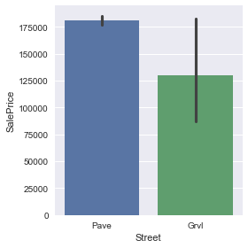


```python
street_map = {
    'Grvl': 0,
    'Pave': 1
}
```

#### Alley

    - Categorical
    - Nominal
    - Lots of NaN values, use dummies


```python
fig, (ax1, ax2) = plt.subplots(1, 2, figsize=(15, 5))
sns.barplot(
    x='Alley',
    y='SalePrice',
    data=train,
    ax=ax1
)
sns.countplot(
    x='Alley',
    data=complete,
    ax=ax2
)
```


    <matplotlib.axes._subplots.AxesSubplot at 0x12d6d73c8>


#### LotShape

    - Categorical
    - Nominal
    - Use dummies


```python
fig, (ax1, ax2) = plt.subplots(1, 2, figsize=(15, 5))
sns.barplot(
    x='LotShape',
    y='SalePrice',
    data=train,
    ax=ax1
)
sns.countplot(
    x='LotShape',
    data=train,
    ax=ax2
)
```


    <matplotlib.axes._subplots.AxesSubplot at 0x12c75be10>


#### LandContour

    - Categorical
    - Nominal
    - Use dummies


```python
fig, (ax1, ax2) = plt.subplots(1, 2, figsize=(15, 5))
sns.barplot(
    x='LandContour',
    y='SalePrice',
    data=train,
    ax=ax1
)
sns.countplot(
    x='LandContour',
    data=train,
    ax=ax2
)
```


    <matplotlib.axes._subplots.AxesSubplot at 0x12db19a58>


#### Utilities

    - Categorical
    - Binary, should be ordinal
    - Use mapping
    - fill NaN with most frequent value


```python
fig, (ax1, ax2) = plt.subplots(1, 2, figsize=(15, 5))
sns.barplot(
    x='Utilities',
    y='SalePrice',
    data=train,
    ax=ax1
)
sns.countplot(
    x='Utilities',
    data=train,
    ax=ax2
)
```


    <matplotlib.axes._subplots.AxesSubplot at 0x12dc099b0>


```python
utilities_map = {
    'NoSeWa': 0,
    'AllPub': 1
}
```

#### LotConfig

    - Categorical
    - Nominal
    - Group those are not 'Corner' and 'Inside' as 'others'
    - Use dummies


```python
fig, (ax1, ax2) = plt.subplots(1, 2, figsize=(15, 5))
sns.barplot(
    x='LotConfig',
    y='SalePrice',
    data=train,
    ax=ax1
)
sns.countplot(
    x='LotConfig',
    data=train,
    ax=ax2
)
```


    <matplotlib.axes._subplots.AxesSubplot at 0x12dce4240>


```python
for dataset in datasets:
    
    dataset.loc[
        (dataset['LotConfig'] != 'Inside') & (dataset['LotConfig'] != 'Corner'),
        'LotConfig'
    ] = 'others'
    
datasets = [train, test]
complete = pd.concat(datasets)
```

#### LandSlope

    - Categorical
    - Nominal
    - Group those are not 'Gtl' as 'others', make it binary
    - Use mapping


```python
fig, (ax1, ax2) = plt.subplots(1, 2, figsize=(15, 5))
sns.barplot(
    x='LandSlope',
    y='SalePrice',
    data=train,
    ax=ax1
)
sns.countplot(
    x='LandSlope',
    data=train,
    ax=ax2
)
```


    <matplotlib.axes._subplots.AxesSubplot at 0x12cecff28>


```python
for dataset in datasets:
    
    dataset.loc[
        (dataset['LandSlope'] != 'Gtl'),
        'LandSlope'
    ] = 'others'
    
datasets = [train, test]
complete = pd.concat(datasets)
```


```python
landslope_map = {
    'Gtl': 1,
    'others': 0
}
```

#### Neighborhood

    - Categorical
    - Should be Ordinal
    - Use mapping


```python
fig, (ax1, ax2) = plt.subplots(1, 2, figsize=(15, 5))
sns.barplot(
    x='Neighborhood',
    y='SalePrice',
    data=train,
    ax=ax1
)
sns.countplot(
    x='Neighborhood',
    data=train,
    ax=ax2
)
```


    <matplotlib.axes._subplots.AxesSubplot at 0x12b185e80>


```python
neighborsale = train[['Neighborhood', 'SalePrice']].groupby(['Neighborhood'], as_index=False).mean().sort_values(by='SalePrice', ascending=False)
neighborsale.index = range(25, 0, -1)
neighborsale = neighborsale.drop('SalePrice', axis=1)
neighborhood_map = {v: k for k, v in neighborsale.to_dict()['Neighborhood'].items()}
neighborhood_map
```


    {'Blmngtn': 16,
     'Blueste': 8,
     'BrDale': 3,
     'BrkSide': 4,
     'ClearCr': 19,
     'CollgCr': 17,
     'Crawfor': 18,
     'Edwards': 5,
     'Gilbert': 15,
     'IDOTRR': 2,
     'MeadowV': 1,
     'Mitchel': 12,
     'NAmes': 11,
     'NPkVill': 10,
     'NWAmes': 14,
     'NoRidge': 25,
     'NridgHt': 24,
     'OldTown': 6,
     'SWISU': 9,
     'Sawyer': 7,
     'SawyerW': 13,
     'Somerst': 20,
     'StoneBr': 23,
     'Timber': 22,
     'Veenker': 21}


#### Condition1 / Condition2

    - Categorical
    - Nominal
    - Manually combine two conditions into dummies, ignore in process data first


```python
fig, (ax1, ax2) = plt.subplots(1, 2, figsize=(15, 5))
sns.barplot(
    x='Condition1',
    y='SalePrice',
    data=train,
    ax=ax1
)
sns.countplot(
    x='Condition1',
    data=train,
    ax=ax2
)
```


    <matplotlib.axes._subplots.AxesSubplot at 0x12de9c320>


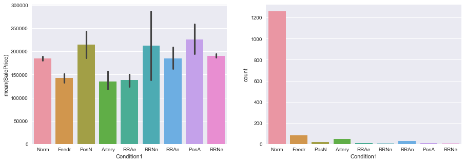


```python
fig, (ax1, ax2) = plt.subplots(1, 2, figsize=(15, 5))
sns.barplot(
    x='Condition2',
    y='SalePrice',
    data=train,
    ax=ax1
)
sns.countplot(
    x='Condition2',
    data=train,
    ax=ax2
)
```


    <matplotlib.axes._subplots.AxesSubplot at 0x12e0f6ef0>


#### BldgType

    - Categorical
    - Nominal
    - Group those are not '1Fam' into 'others', make it binary
    - Use mapping


```python
fig, (ax1, ax2) = plt.subplots(1, 2, figsize=(15, 5))
sns.barplot(
    x='BldgType',
    y='SalePrice',
    data=train,
    ax=ax1
)
sns.countplot(
    x='BldgType',
    data=train,
    ax=ax2
)
```


    <matplotlib.axes._subplots.AxesSubplot at 0x12e34b828>


```python
for dataset in datasets:
    
    dataset.loc[
        (dataset['BldgType'] != '1Fam'),
        'BldgType'
    ] = 'others'
    
datasets = [train, test]
complete = pd.concat(datasets)
```


```python
bldgtype_map = {
    '1Fam': 1,
    'others': 0
}
```

#### HouseStyle

    - Categorical
    - Nominal
    - Group those are not '1.5Fin', '1Story', '2Story' into 'others'
    - Use dummies


```python
fig, (ax1, ax2) = plt.subplots(1, 2, figsize=(15, 5))
sns.barplot(
    x='HouseStyle',
    y='SalePrice',
    data=train,
    ax=ax1
)
sns.countplot(
    x='HouseStyle',
    data=train,
    ax=ax2
)
```


    <matplotlib.axes._subplots.AxesSubplot at 0x12e56f208>


```python
for dataset in datasets:
    
    dataset.loc[
        (dataset['HouseStyle'] != '2Story') & (dataset['HouseStyle'] != '1Story') & (dataset['HouseStyle'] != '1.5Fin'),
        'HouseStyle'
    ] = 'others'
    
datasets = [train, test]
complete = pd.concat(datasets)
```

#### RoofStyle

    - Categorial
    - Nominal
    - Group those are not 'Gable', 'Hip', into 'others'
    - Use dummies


```python
fig, (ax1, ax2) = plt.subplots(1, 2, figsize=(15, 5))
sns.barplot(
    x='RoofStyle',
    y='SalePrice',
    data=train,
    ax=ax1
)
sns.countplot(
    x='RoofStyle',
    data=train,
    ax=ax2
)
```


    <matplotlib.axes._subplots.AxesSubplot at 0x12e7c15c0>


```python
for dataset in datasets:
    
    dataset.loc[
        (dataset['RoofStyle'] != 'Gable') & (dataset['RoofStyle'] != 'Hip'),
        'RoofStyle'
    ] = 'others'
    
datasets = [train, test]
complete = pd.concat(datasets)
```

#### RoofMatl

    - Categorial
    - Nominal
    - Group those are not 'CompShg' into 'others', make it binary
    - Use mapping


```python
fig, (ax1, ax2) = plt.subplots(1, 2, figsize=(15, 5))
sns.barplot(
    x='RoofMatl',
    y='SalePrice',
    data=train,
    ax=ax1
)
sns.countplot(
    x='RoofMatl',
    data=train,
    ax=ax2
)
```


    <matplotlib.axes._subplots.AxesSubplot at 0x12e9ec9e8>


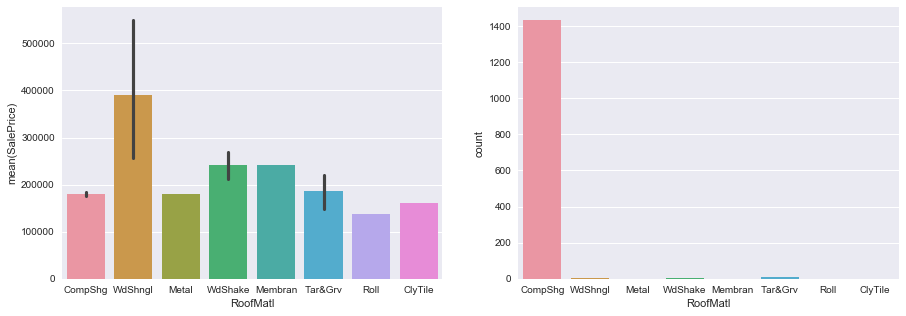


```python
for dataset in datasets:
    
    dataset.loc[
        (dataset['RoofMatl'] != 'CompShg'),
        'RoofMatl'
    ] = 'others'
    
datasets = [train, test]
complete = pd.concat(datasets)
```


```python
roofmatl_map = {
    'CompShg': 1,
    'others': 0
}
```

#### Exterior1st / Exterior2nd

    - Categorial
    - Nominal
    - Manually combine two conditions into dummies
    - fill NaN with most frequent


```python
fig, (ax1, ax2) = plt.subplots(1, 2, figsize=(15, 5))
sns.barplot(
    x='Exterior1st',
    y='SalePrice',
    data=train,
    ax=ax1
)
sns.countplot(
    x='Exterior1st',
    data=train,
    ax=ax2
)
```


    <matplotlib.axes._subplots.AxesSubplot at 0x12ec3c0b8>


#### MasVnrType

    - Categorial
    - Nominal
    - fill NaN with most frequent
    - Use dummies


```python
fig, (ax1, ax2) = plt.subplots(1, 2, figsize=(15, 5))
sns.barplot(
    x='MasVnrType',
    y='SalePrice',
    data=train,
    ax=ax1
)
sns.countplot(
    x='MasVnrType',
    data=train,
    ax=ax2
)
```


    <matplotlib.axes._subplots.AxesSubplot at 0x12edda8d0>


#### MasVnrArea
    - Numerical
    - first check if fill with 0 for MasVnrType is 'None'
    - fill NaN with median


```python
train.loc[(train['MasVnrType'] == 'None') & (train['MasVnrArea'].isnull())]
```


<div>
<table border="1" class="dataframe">
  <thead>
    <tr style="text-align: right;">
      <th></th>
      <th>Id</th>
      <th>MSSubClass</th>
      <th>MSZoning</th>
      <th>LotFrontage</th>
      <th>LotArea</th>
      <th>Street</th>
      <th>Alley</th>
      <th>LotShape</th>
      <th>LandContour</th>
      <th>Utilities</th>
      <th>...</th>
      <th>PoolArea</th>
      <th>PoolQC</th>
      <th>Fence</th>
      <th>MiscFeature</th>
      <th>MiscVal</th>
      <th>MoSold</th>
      <th>YrSold</th>
      <th>SaleType</th>
      <th>SaleCondition</th>
      <th>SalePrice</th>
    </tr>
  </thead>
  <tbody>
  </tbody>
</table>
<p>0 rows × 81 columns</p>
</div>


```python
test.loc[(test['MasVnrType'] == 'None') & (test['MasVnrArea'].isnull())]
```


<div>
<table border="1" class="dataframe">
  <thead>
    <tr style="text-align: right;">
      <th></th>
      <th>Id</th>
      <th>MSSubClass</th>
      <th>MSZoning</th>
      <th>LotFrontage</th>
      <th>LotArea</th>
      <th>Street</th>
      <th>Alley</th>
      <th>LotShape</th>
      <th>LandContour</th>
      <th>Utilities</th>
      <th>...</th>
      <th>ScreenPorch</th>
      <th>PoolArea</th>
      <th>PoolQC</th>
      <th>Fence</th>
      <th>MiscFeature</th>
      <th>MiscVal</th>
      <th>MoSold</th>
      <th>YrSold</th>
      <th>SaleType</th>
      <th>SaleCondition</th>
    </tr>
  </thead>
  <tbody>
  </tbody>
</table>
<p>0 rows × 80 columns</p>
</div>


#### ExterQual / ExterCond

    - Categorical
    - Ordinal
    - Use mapping


```python
fig, (ax1, ax2) = plt.subplots(1, 2, figsize=(15, 5))
sns.barplot(
    x='ExterQual',
    y='SalePrice',
    data=train,
    ax=ax1
)
sns.countplot(
    x='ExterQual',
    data=train,
    ax=ax2
)
```


    <matplotlib.axes._subplots.AxesSubplot at 0x12f1047b8>


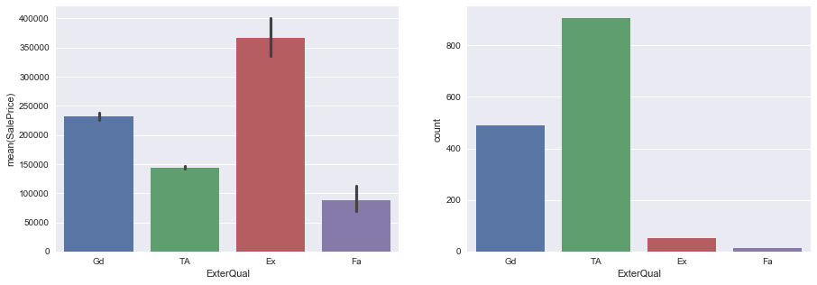


```python
fig, (ax1, ax2) = plt.subplots(1, 2, figsize=(15, 5))
sns.barplot(
    x='ExterCond',
    y='SalePrice',
    data=train,
    ax=ax1
)
sns.countplot(
    x='ExterCond',
    data=train,
    ax=ax2
)
```


    <matplotlib.axes._subplots.AxesSubplot at 0x12f310908>


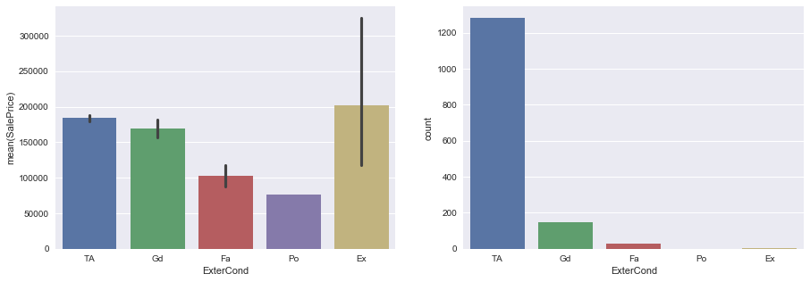


```python
exter_map = {
    'Po': 0,
    'Fa': 1,
    'TA': 2,
    'Gd': 3,
    'Ex': 4
}
```

#### Foundation

    - Categorical
    - Nominal
    - Use dummies


```python
fig, (ax1, ax2) = plt.subplots(1, 2, figsize=(15, 5))
sns.barplot(
    x='Foundation',
    y='SalePrice',
    data=train,
    ax=ax1
)
sns.countplot(
    x='Foundation',
    data=train,
    ax=ax2
)
```


    <matplotlib.axes._subplots.AxesSubplot at 0x12f52b2b0>


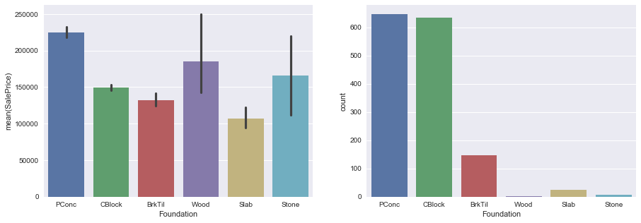


```python
for dataset in datasets:
    
    dataset.loc[
        (dataset['Foundation'] != 'PConc') & (dataset['Foundation'] != 'CBlock') & (dataset['Foundation'] != 'BrkTil'),
        'Foundation'
    ] = 'others'
    
datasets = [train, test]
complete = pd.concat(datasets)
```

#### BsmtQual / BsmtCond

    - Categorical
    - Ordinal
    - Use mapping
    - fill NaN with 'NA', no basement


```python
fig, (ax1, ax2) = plt.subplots(1, 2, figsize=(15, 5))
sns.barplot(
    x='BsmtQual',
    y='SalePrice',
    data=train,
    ax=ax1
)
sns.countplot(
    x='BsmtQual',
    data=train,
    ax=ax2
)
```


    <matplotlib.axes._subplots.AxesSubplot at 0x12f750550>


```python
fig, (ax1, ax2) = plt.subplots(1, 2, figsize=(15, 5))
sns.barplot(
    x='BsmtCond',
    y='SalePrice',
    data=train,
    ax=ax1
)
sns.countplot(
    x='BsmtCond',
    data=train,
    ax=ax2
)
```


    <matplotlib.axes._subplots.AxesSubplot at 0x12f965358>


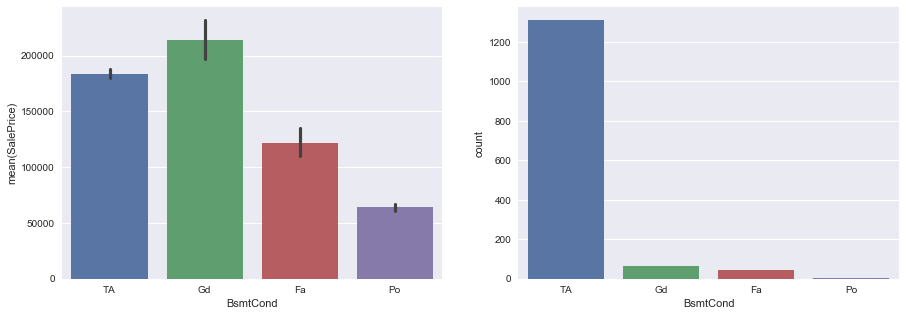


```python
train['BsmtQual'].fillna('NA', inplace=True)
test['BsmtQual'].fillna('NA', inplace=True)
train['BsmtCond'].fillna('NA', inplace=True)
test['BsmtCond'].fillna('NA', inplace=True)
datasets = [train, test]
complete = pd.concat(datasets)

# np.nan != np.nan, so replace with 'NA' first

bsmt_map = {
    'NA': 0,
    'Po': 1,
    'Fa': 2,
    'TA': 3,
    'Gd': 4,
    'Ex': 5
}
```

#### BsmtExposure

    - Categorical
    - Ordinal
    - Use mapping
    - fill NaN with 'NA', no basement


```python
fig, (ax1, ax2) = plt.subplots(1, 2, figsize=(15, 5))
sns.barplot(
    x='BsmtExposure',
    y='SalePrice',
    data=train,
    ax=ax1
)
sns.countplot(
    x='BsmtExposure',
    data=train,
    ax=ax2
)
```


    <matplotlib.axes._subplots.AxesSubplot at 0x12fb699b0>


```python
train['BsmtExposure'].fillna('NA', inplace=True)
test['BsmtExposure'].fillna('NA', inplace=True)
datasets = [train, test]
complete = pd.concat(datasets)

# np.nan != np.nan, so replace with 'NA' first

bsmtexposure_map = {
    'NA': 0,
    'No': 1,
    'Mn': 2,
    'Av': 3,
    'Gd': 4
}
```

#### BsmtFinSF1 / BsmtFinType1 / BsmtFinSF2 / BsmtFinType2 / BsmtUnfSF

    - Categorical (ordinal) / Numerical
    - manually combine the first four into one feature 'BsmtFinScore' after data processing
    - fill NaN values with 'NA'
    - use mapping


```python
fig, (ax1, ax2) = plt.subplots(1, 2, figsize=(15, 5))
sns.barplot(
    x='BsmtFinType1',
    y='SalePrice',
    data=train,
    ax=ax1
)
sns.countplot(
    x='BsmtFinType1',
    data=train,
    ax=ax2
)
```


    <matplotlib.axes._subplots.AxesSubplot at 0x12fd76be0>


```python
fig, (ax1, ax2) = plt.subplots(1, 2, figsize=(15, 5))
sns.barplot(
    x='BsmtFinType2',
    y='SalePrice',
    data=train,
    ax=ax1
)
sns.countplot(
    x='BsmtFinType2',
    data=train,
    ax=ax2
)
```


    <matplotlib.axes._subplots.AxesSubplot at 0x12ff9d6a0>


```python
train['BsmtFinType1'].fillna('NA', inplace=True)
test['BsmtFinType1'].fillna('NA', inplace=True)
train['BsmtFinType2'].fillna('NA', inplace=True)
test['BsmtFinType2'].fillna('NA', inplace=True)

test['BsmtFinSF1'].fillna(0.0, inplace=True)
test['BsmtFinSF2'].fillna(0.0, inplace=True)

datasets = [train, test]
complete = pd.concat(datasets)

# np.nan != np.nan, so replace with 'NA' first

bsmtfintype_map = {
    'NA': 0,
    'Unf': 1,
    'LwQ': 2,
    'Rec': 3,
    'BLQ': 4,
    'ALQ': 5,
    'GLQ': 6
}
```

#### TotalBsmtSF

    - Numerical
    - fill NaN with zero, no basement


```python
test['TotalBsmtSF'].fillna(0.0, inplace=True)
```

#### Heating

    - Categorinal
    - Nominal
    - Combine heating with less counts as 'others'
    - use dummies


```python
fig, (ax1, ax2) = plt.subplots(1, 2, figsize=(15, 5))
sns.barplot(
    x='Heating',
    y='SalePrice',
    data=train,
    ax=ax1
)
sns.countplot(
    x='Heating',
    data=train,
    ax=ax2
)
```


    <matplotlib.axes._subplots.AxesSubplot at 0x1301c7ac8>


```python
for dataset in datasets:
    
    dataset.loc[(dataset['Heating'] != 'GasA'), 'Heating'] = 'others'

datasets = [train, test]
complete = pd.concat(datasets)
```


```python
heating_map = {
    'GasA': 1,
    'others': 0
}
```

#### HeatingQC

    - Categorinal
    - Ordinal
    - use mapping


```python
fig, (ax1, ax2) = plt.subplots(1, 2, figsize=(15,5))
sns.barplot(
    x='HeatingQC',
    y='SalePrice',
    data=train,
    ax=ax1
)
sns.countplot(
    x='HeatingQC',
    data=train,
    ax=ax2
)
```


    <matplotlib.axes._subplots.AxesSubplot at 0x1303fe668>


```python
heatingqc_map = {
    'Po': 0,
    'Fa': 1,
    'TA': 2,
    'Gd': 3,
    'Ex': 4
}
```

#### CentralAir

    - Categorinal
    - Binary, nominal
    - use mapping


```python
centralair_map = {
    'N': 0,
    'Y': 1
}
```

#### Electrical

    - Categorinal
    - Nominal
    - combine value other than 'SBrkr' into 'others' and make it binary
    - use mapping


```python
fig, (ax1, ax2) = plt.subplots(1, 2, figsize=(15,5))
sns.barplot(
    x='Electrical',
    y='SalePrice',
    data=train,
    ax=ax1
)
sns.countplot(
    x='Electrical',
    data=train,
    ax=ax2
)
```


    <matplotlib.axes._subplots.AxesSubplot at 0x130616a58>


```python
for dataset in datasets:
    
    dataset.loc[(dataset['Electrical'] != 'SBrkr'), 'Electrical'] = 'others'
    
datasets = [train, test]
complete = pd.concat(datasets)
```


```python
electrical_map = {
    'SBrkr': 1,
    'others': 0
}
```

#### BsmtFullBath / BsmtHalfBath

    - Categorinal
    - Ordinal
    - fill NaN with most frequent


```python
fig, (ax1, ax2) = plt.subplots(1, 2, figsize=(15,5))
sns.barplot(
    x='BsmtFullBath',
    y='SalePrice',
    data=train,
    ax=ax1
)
sns.countplot(
    x='BsmtFullBath',
    data=train,
    ax=ax2
)
```


    <matplotlib.axes._subplots.AxesSubplot at 0x130837278>


```python
fig, (ax1, ax2) = plt.subplots(1, 2, figsize=(15,5))
sns.barplot(
    x='BsmtHalfBath',
    y='SalePrice',
    data=train,
    ax=ax1
)
sns.countplot(
    x='BsmtHalfBath',
    data=train,
    ax=ax2
)
```


    <matplotlib.axes._subplots.AxesSubplot at 0x130a50710>


#### KitchenQual

    - Categorinal
    - Ordinal
    - use mapping


```python
fig, (ax1, ax2) = plt.subplots(1, 2, figsize=(15,5))
sns.barplot(
    x='KitchenQual',
    y='SalePrice',
    data=train,
    ax=ax1
)
sns.countplot(
    x='KitchenQual',
    data=train,
    ax=ax2
)
```


    <matplotlib.axes._subplots.AxesSubplot at 0x130ab43c8>


```python
train['KitchenQual'].fillna('NA', inplace=True)
test['KitchenQual'].fillna('NA', inplace=True)

datasets = [train, test]
complete = pd.concat(datasets)
```


```python
kitchenqual_map = {
    'NA': 0,
    'Fa': 1,
    'TA': 2,
    'Gd': 3,
    'Ex': 4
}
```

#### Functional

    - Categorinal
    - Ordinal
    - Combine those are not 'Typ' into 'others'
    - fill NaN with 'others'
    - use mapping


```python
fig, (ax1, ax2) = plt.subplots(1, 2, figsize=(15,5))
sns.barplot(
    x='Functional',
    y='SalePrice',
    data=train,
    ax=ax1
)
sns.countplot(
    x='Functional',
    data=train,
    ax=ax2
)
```


    <matplotlib.axes._subplots.AxesSubplot at 0x130ddcd68>


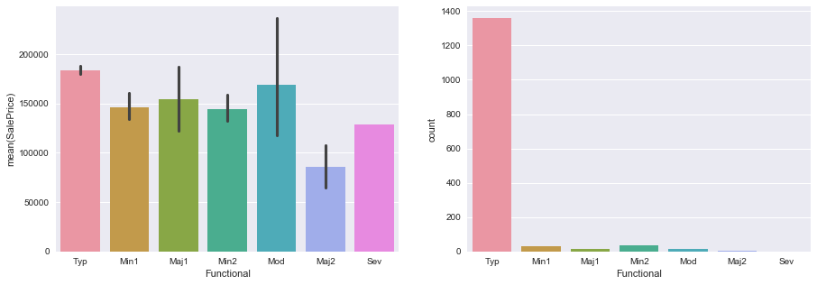


```python
for dataset in datasets:
    
    dataset.loc[(dataset['Functional'] != 'Typ'), 'Functional'] = 'others'
    
datasets = [train, test]
complete = pd.concat(datasets)
```


```python
functional_map = {
    'Typ': 1,
    'others': 0
}
```

#### FireplaceQu

    - Categorinal
    - Ordinal
    - use mapping


```python
fig, (ax1, ax2) = plt.subplots(1, 2, figsize=(15,5))
sns.barplot(
    x='FireplaceQu',
    y='SalePrice',
    data=train,
    ax=ax1
)
sns.countplot(
    x='FireplaceQu',
    data=train,
    ax=ax2
)
```


    <matplotlib.axes._subplots.AxesSubplot at 0x13101c4a8>


```python
train['FireplaceQu'].fillna('NA', inplace=True)
test['FireplaceQu'].fillna('NA', inplace=True)

datasets = [train, test]
complete = pd.concat(datasets)
```


```python
fireplacequ_map = {
    'NA': 0,
    'Po': 1,
    'Fa': 2,
    'TA': 3,
    'Gd': 4,
    'Ex': 5
}
```

#### GarageType

    - Categorinal
    - Nominal
    - combine types with smaller counts into 'others'
    - use dummies


```python
fig, (ax1, ax2) = plt.subplots(1, 2, figsize=(15,5))
sns.barplot(
    x='GarageType',
    y='SalePrice',
    data=train,
    ax=ax1
)
sns.countplot(
    x='GarageType',
    data=train,
    ax=ax2
)
```


    <matplotlib.axes._subplots.AxesSubplot at 0x1312417f0>


```python
for dataset in datasets:
    
    dataset.loc[
        (dataset['GarageType'] != 'Attchd') & (dataset['GarageType'] != 'Detchd') & ~(dataset['GarageType'].isnull()),
        'GarageType'
    ] = 'others'
    
datasets = [train, test]
complete = pd.concat(datasets)
```

#### GarageYrBlt

    - Numerical
    - fill NaN with clearly out of range -1

#### GarageFinish

    - Categorical
    - Ordinal
    - use mappings


```python
fig, (ax1, ax2) = plt.subplots(1, 2, figsize=(15,5))
sns.barplot(
    x='GarageFinish',
    y='SalePrice',
    data=train,
    ax=ax1
)
sns.countplot(
    x='GarageFinish',
    data=train,
    ax=ax2
)
```


    <matplotlib.axes._subplots.AxesSubplot at 0x13146a048>


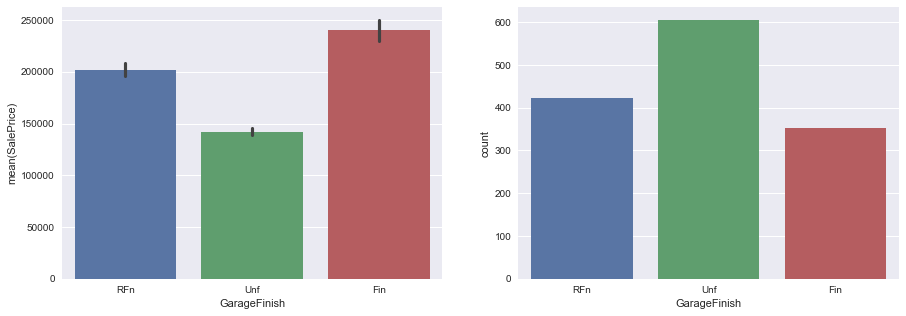


```python
train['GarageFinish'].fillna('NA', inplace=True)
test['GarageFinish'].fillna('NA', inplace=True)

datasets = [train, test]
complete = pd.concat(datasets)
```


```python
garagefinish_map = {
    'NA': 0,
    'Unf': 1,
    'RFn': 2,
    'Fin': 3
}
```

#### GarageCars / GarageArea

    - Numerical
    - fill NaN with 0


```python
train['GarageCars'].fillna(0, inplace=True)
test['GarageCars'].fillna(0, inplace=True)

train['GarageArea'].fillna(0, inplace=True)
test['GarageArea'].fillna(0, inplace=True)

datasets = [train, test]
complete = pd.concat(datasets)
```

#### GarageQual / GarageCond

    - Categorical
    - Ordinal
    - Use mapping


```python
fig, (ax1, ax2) = plt.subplots(1, 2, figsize=(15,5))
sns.barplot(
    x='GarageQual',
    y='SalePrice',
    data=train,
    ax=ax1
)
sns.countplot(
    x='GarageQual',
    data=train,
    ax=ax2
)
```


    <matplotlib.axes._subplots.AxesSubplot at 0x131666c18>


```python
fig, (ax1, ax2) = plt.subplots(1, 2, figsize=(15,5))
sns.barplot(
    x='GarageCond',
    y='SalePrice',
    data=train,
    ax=ax1
)
sns.countplot(
    x='GarageCond',
    data=train,
    ax=ax2
)
```


    <matplotlib.axes._subplots.AxesSubplot at 0x131883208>


```python
train['GarageQual'].fillna('NA', inplace=True)
test['GarageQual'].fillna('NA', inplace=True)

train['GarageCond'].fillna('NA', inplace=True)
test['GarageCond'].fillna('NA', inplace=True)

datasets = [train, test]
complete = pd.concat(datasets)
```


```python
garage_map = {
    'NA': 0,
    'Po': 1,
    'Fa': 2,
    'TA': 3,
    'Gd': 4,
    'Ex': 5
}
```

#### PavedDrive

    - Categorical
    - Should be ordinal
    - Use mapping


```python
fig, (ax1, ax2) = plt.subplots(1, 2, figsize=(15,5))
sns.barplot(
    x='PavedDrive',
    y='SalePrice',
    data=train,
    ax=ax1
)
sns.countplot(
    x='PavedDrive',
    data=train,
    ax=ax2
)
```


    <matplotlib.axes._subplots.AxesSubplot at 0x131a97a58>


```python
paveddrive_map = {
    'N': 0,
    'P': 1,
    'Y': 2
}
```

#### PoolQC

    - Categorical
    - Ordinal
    - Use mapping


```python
fig, (ax1, ax2) = plt.subplots(1, 2, figsize=(15,5))
sns.barplot(
    x='PoolQC',
    y='SalePrice',
    data=train,
    ax=ax1
)
sns.countplot(
    x='PoolQC',
    data=train,
    ax=ax2
)
```


    <matplotlib.axes._subplots.AxesSubplot at 0x131c99c88>


```python
train['PoolQC'].fillna('NA', inplace=True)
test['PoolQC'].fillna('NA', inplace=True)

datasets = [train, test]
complete = pd.concat(datasets)
```


```python
poolqc_map = {
    'NA': 0,
    'Fa': 1,
    'Gd': 2,
    'Ex': 3
}
```

#### Fence

    - Categorical
    - Nominal
    - Use dummies


```python
fig, (ax1, ax2) = plt.subplots(1, 2, figsize=(15,5))
sns.barplot(
    x='Fence',
    y='SalePrice',
    data=train,
    ax=ax1
)
sns.countplot(
    x='Fence',
    data=train,
    ax=ax2
)
```


    <matplotlib.axes._subplots.AxesSubplot at 0x131ea19e8>


#### MiscFeature / MiscVal

    - Categorical
    - Nominal
    - Use dummies, drop NaN dummies
    - manually multiply MiscVal to respective MiscFeature dummies


```python
fig, (ax1, ax2) = plt.subplots(1, 2, figsize=(15,5))
sns.barplot(
    x='MiscFeature',
    y='SalePrice',
    data=train,
    ax=ax1
)
sns.countplot(
    x='MiscFeature',
    data=train,
    ax=ax2
)
```


    <matplotlib.axes._subplots.AxesSubplot at 0x1320b2470>


#### SaleType

    - Categorical
    - Nominal
    - Group those are not 'WD', 'New', 'COD' as 'others'
    - fill NaN with 'others'
    - Use dummies


```python
fig, (ax1, ax2) = plt.subplots(1, 2, figsize=(15,5))
sns.barplot(
    x='SaleType',
    y='SalePrice',
    data=train,
    ax=ax1
)
sns.countplot(
    x='SaleType',
    data=train,
    ax=ax2
)
```


    <matplotlib.axes._subplots.AxesSubplot at 0x1322c0470>


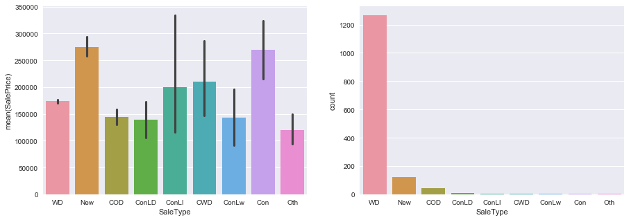


```python
for dataset in datasets:
    
    dataset.loc[
        (dataset['SaleType'] != 'WD') & (dataset['SaleType'] != 'New') & (dataset['SaleType'] != 'COD'),
        'SaleType'
    ] = 'others'
    
datasets = [train, test]
complete = pd.concat(datasets)
```

#### SaleCondition

    - Categorical
    - Nominal
    - Group those are not 'Normal', 'Abnorml', 'Partial' as 'others'
    - fill NaN with 'others'
    - Use dummies


```python
fig, (ax1, ax2) = plt.subplots(1, 2, figsize=(15,5))
sns.barplot(
    x='SaleCondition',
    y='SalePrice',
    data=train,
    ax=ax1
)
sns.countplot(
    x='SaleCondition',
    data=train,
    ax=ax2
)
```


    <matplotlib.axes._subplots.AxesSubplot at 0x132520898>


```python
for dataset in datasets:
    
    dataset.loc[
        (dataset['SaleCondition'] != 'Normal') & (dataset['SaleCondition'] != 'Abnorml') & (dataset['SaleCondition'] != 'Partial'),
        'SaleCondition'
    ] = 'others'
    
datasets = [train, test]
complete = pd.concat(datasets)
```


```python
print(train.columns)
print(complete['SaleCondition'].isnull().any())
complete['SaleCondition']
```

    Index(['Id', 'MSSubClass', 'MSZoning', 'LotFrontage', 'LotArea', 'Street',
           'Alley', 'LotShape', 'LandContour', 'Utilities', 'LotConfig',
           'LandSlope', 'Neighborhood', 'Condition1', 'Condition2', 'BldgType',
           'HouseStyle', 'OverallQual', 'OverallCond', 'YearBuilt', 'YearRemodAdd',
           'RoofStyle', 'RoofMatl', 'Exterior1st', 'Exterior2nd', 'MasVnrType',
           'MasVnrArea', 'ExterQual', 'ExterCond', 'Foundation', 'BsmtQual',
           'BsmtCond', 'BsmtExposure', 'BsmtFinType1', 'BsmtFinSF1',
           'BsmtFinType2', 'BsmtFinSF2', 'BsmtUnfSF', 'TotalBsmtSF', 'Heating',
           'HeatingQC', 'CentralAir', 'Electrical', '1stFlrSF', '2ndFlrSF',
           'LowQualFinSF', 'GrLivArea', 'BsmtFullBath', 'BsmtHalfBath', 'FullBath',
           'HalfBath', 'BedroomAbvGr', 'KitchenAbvGr', 'KitchenQual',
           'TotRmsAbvGrd', 'Functional', 'Fireplaces', 'FireplaceQu', 'GarageType',
           'GarageYrBlt', 'GarageFinish', 'GarageCars', 'GarageArea', 'GarageQual',
           'GarageCond', 'PavedDrive', 'WoodDeckSF', 'OpenPorchSF',
           'EnclosedPorch', '3SsnPorch', 'ScreenPorch', 'PoolArea', 'PoolQC',
           'Fence', 'MiscFeature', 'MiscVal', 'MoSold', 'YrSold', 'SaleType',
           'SaleCondition', 'SalePrice'],
          dtype='object')
    False


    0        Normal
    1        Normal
    2        Normal
    3       Abnorml
    4        Normal
    5        Normal
    6        Normal
    7        Normal
    8       Abnorml
    9        Normal
    10       Normal
    11      Partial
    12       Normal
    13      Partial
    14       Normal
    15       Normal
    16       Normal
    17       Normal
    18       Normal
    19      Abnorml
    20      Partial
    21       Normal
    22       Normal
    23       Normal
    24       Normal
    25       Normal
    26       Normal
    27       Normal
    28       Normal
    29       Normal
             ...   
    1429     Normal
    1430     Normal
    1431    Abnorml
    1432    Abnorml
    1433     Normal
    1434    Partial
    1435     Normal
    1436     Normal
    1437     Normal
    1438     Normal
    1439     Normal
    1440     others
    1441     Normal
    1442    Partial
    1443    Partial
    1444     Normal
    1445     Normal
    1446     Normal
    1447     Normal
    1448     Normal
    1449     Normal
    1450     Normal
    1451     Normal
    1452    Abnorml
    1453     Normal
    1454     Normal
    1455    Abnorml
    1456    Abnorml
    1457     Normal
    1458     Normal
    Name: SaleCondition, dtype: object


```python
summerize = pd.DataFrame({
    'Features': train.columns[1:80],
    'ignore': [
        False, False, False, False, False, False, False, False, False, False,
        False, False, True, True, False, False, True, True, True, True,
        False, False, False, False, False, False, False, False, False, False,
        False, False, False, True, False, True, True, False, False, False,
        False, False, False, False, False, False, False, False, False, False,
        False, False, False, False, False, False, False, False, False, False,
        False, False, False, False, False, False, False, False, False, False,
        False, False, False, False, True, True, True, False, False
    ],
    'isCategorical': [
        False, True, False, False, True, True, True, True, True, True,
        True, True, True, True, True, True, True, True, False, False,
        True, True, True, True, True, False, True, True, True, True,
        True, True, True, False, True, False, False, False, True, True,
        True, True, False, False, False, False, False, False, False, False, 
        False, False, True, False, True, False, True, True, False, True,
        False, False, True, True, True, False, False, False, False, False,
        False, True, True, True, False, False, False, True, True
    ],
    'isOrdinal': [
        None, True, None, None, False, False, False, False, True, False,
        False, True, False, False, False, False, True, True, False, False,
        False, False, False, False, False, False, True, True, False, True,
        True, True, True, False, True, False, False, False, False, True,
        True, False, False, False, False, False, False, False, False, False,
        False, False, True, False, False, False, True, False, False, True,
        False, False, True, True, True, False, False, False, False, False,
        False, True, False, False, False, False, False, False, False
    ],
    'hasNaN': [
        complete[col].isnull().any() for col in train.columns[1:80]
    ],
    'fillNaNMethod': [
        None, 'frequent', 'median', None, None, None, None, None, 'frequent', None,
        None, None, None, None, None, None, None, None, None, None,
        None, None, 'frequent', 'frequent', 'frequent', 'median', None, None, None, None,
        None, None, None, None, None, None, None, None, None, None,
        None, None, None, None, None, None, 'frequent', 'frequent', None, None,
        None, None, None, None, None, None, None, None, -1, None,
        None, None, None, None, None, None, None, None, None, None,
        None, None, None, None, None, None, None, None, None
    ],
    'mapping': [
        None, mszoning_map, None, None, street_map, None, None, None, utilities_map, None,
        landslope_map, neighborhood_map, None, None, bldgtype_map, None, None, None, None, None,
        None, roofmatl_map, None, None, None, None, exter_map, exter_map, None, bsmt_map,
        bsmt_map, bsmtexposure_map, bsmtfintype_map, None, bsmtfintype_map, None, None, None, heating_map, heatingqc_map,
        centralair_map, electrical_map, None, None, None, None, None, None, None, None,
        None, None, kitchenqual_map, None, functional_map, None, fireplacequ_map, None, None, garagefinish_map,
        None, None, garage_map, garage_map, paveddrive_map, None, None, None, None, None,
        None, poolqc_map, None, None, None, None, None, None, None
    ],
    'useDummies': [
        False, False, False, False, False, True, True, True, False, True,
        False, False, True, True, False, True, False, False, False, False,
        True, False, False, False, True, False, False, False, True, False,
        False, False, False, False, False, False, False, False, False, False,
        False, False, False, False, False, False, False, False, False, False,
        False, False, False, False, False, False, False, True, False, False,
        False, False, False, False, False, False, False, False, False, False,
        False, False, True, True, False, False, False, True, True
    ]
})
summerize
```


<div>
<table border="1" class="dataframe">
  <thead>
    <tr style="text-align: right;">
      <th></th>
      <th>Features</th>
      <th>fillNaNMethod</th>
      <th>hasNaN</th>
      <th>ignore</th>
      <th>isCategorical</th>
      <th>isOrdinal</th>
      <th>mapping</th>
      <th>useDummies</th>
    </tr>
  </thead>
  <tbody>
    <tr>
      <th>0</th>
      <td>MSSubClass</td>
      <td>None</td>
      <td>False</td>
      <td>False</td>
      <td>False</td>
      <td>None</td>
      <td>None</td>
      <td>False</td>
    </tr>
    <tr>
      <th>1</th>
      <td>MSZoning</td>
      <td>frequent</td>
      <td>True</td>
      <td>False</td>
      <td>True</td>
      <td>True</td>
      <td>{'RL': 3, 'RM': 1, 'FV': 4, 'RH': 2, 'C (all)'...</td>
      <td>False</td>
    </tr>
    <tr>
      <th>2</th>
      <td>LotFrontage</td>
      <td>median</td>
      <td>True</td>
      <td>False</td>
      <td>False</td>
      <td>None</td>
      <td>None</td>
      <td>False</td>
    </tr>
    <tr>
      <th>3</th>
      <td>LotArea</td>
      <td>None</td>
      <td>False</td>
      <td>False</td>
      <td>False</td>
      <td>None</td>
      <td>None</td>
      <td>False</td>
    </tr>
    <tr>
      <th>4</th>
      <td>Street</td>
      <td>None</td>
      <td>False</td>
      <td>False</td>
      <td>True</td>
      <td>False</td>
      <td>{'Grvl': 0, 'Pave': 1}</td>
      <td>False</td>
    </tr>
    <tr>
      <th>5</th>
      <td>Alley</td>
      <td>None</td>
      <td>True</td>
      <td>False</td>
      <td>True</td>
      <td>False</td>
      <td>None</td>
      <td>True</td>
    </tr>
    <tr>
      <th>6</th>
      <td>LotShape</td>
      <td>None</td>
      <td>False</td>
      <td>False</td>
      <td>True</td>
      <td>False</td>
      <td>None</td>
      <td>True</td>
    </tr>
    <tr>
      <th>7</th>
      <td>LandContour</td>
      <td>None</td>
      <td>False</td>
      <td>False</td>
      <td>True</td>
      <td>False</td>
      <td>None</td>
      <td>True</td>
    </tr>
    <tr>
      <th>8</th>
      <td>Utilities</td>
      <td>frequent</td>
      <td>True</td>
      <td>False</td>
      <td>True</td>
      <td>True</td>
      <td>{'NoSeWa': 0, 'AllPub': 1}</td>
      <td>False</td>
    </tr>
    <tr>
      <th>9</th>
      <td>LotConfig</td>
      <td>None</td>
      <td>False</td>
      <td>False</td>
      <td>True</td>
      <td>False</td>
      <td>None</td>
      <td>True</td>
    </tr>
    <tr>
      <th>10</th>
      <td>LandSlope</td>
      <td>None</td>
      <td>False</td>
      <td>False</td>
      <td>True</td>
      <td>False</td>
      <td>{'others': 0, 'Gtl': 1}</td>
      <td>False</td>
    </tr>
    <tr>
      <th>11</th>
      <td>Neighborhood</td>
      <td>None</td>
      <td>False</td>
      <td>False</td>
      <td>True</td>
      <td>True</td>
      <td>{'NPkVill': 10, 'BrDale': 3, 'NridgHt': 24, 'T...</td>
      <td>False</td>
    </tr>
    <tr>
      <th>12</th>
      <td>Condition1</td>
      <td>None</td>
      <td>False</td>
      <td>True</td>
      <td>True</td>
      <td>False</td>
      <td>None</td>
      <td>True</td>
    </tr>
    <tr>
      <th>13</th>
      <td>Condition2</td>
      <td>None</td>
      <td>False</td>
      <td>True</td>
      <td>True</td>
      <td>False</td>
      <td>None</td>
      <td>True</td>
    </tr>
    <tr>
      <th>14</th>
      <td>BldgType</td>
      <td>None</td>
      <td>False</td>
      <td>False</td>
      <td>True</td>
      <td>False</td>
      <td>{'1Fam': 1, 'others': 0}</td>
      <td>False</td>
    </tr>
    <tr>
      <th>15</th>
      <td>HouseStyle</td>
      <td>None</td>
      <td>False</td>
      <td>False</td>
      <td>True</td>
      <td>False</td>
      <td>None</td>
      <td>True</td>
    </tr>
    <tr>
      <th>16</th>
      <td>OverallQual</td>
      <td>None</td>
      <td>False</td>
      <td>True</td>
      <td>True</td>
      <td>True</td>
      <td>None</td>
      <td>False</td>
    </tr>
    <tr>
      <th>17</th>
      <td>OverallCond</td>
      <td>None</td>
      <td>False</td>
      <td>True</td>
      <td>True</td>
      <td>True</td>
      <td>None</td>
      <td>False</td>
    </tr>
    <tr>
      <th>18</th>
      <td>YearBuilt</td>
      <td>None</td>
      <td>False</td>
      <td>True</td>
      <td>False</td>
      <td>False</td>
      <td>None</td>
      <td>False</td>
    </tr>
    <tr>
      <th>19</th>
      <td>YearRemodAdd</td>
      <td>None</td>
      <td>False</td>
      <td>True</td>
      <td>False</td>
      <td>False</td>
      <td>None</td>
      <td>False</td>
    </tr>
    <tr>
      <th>20</th>
      <td>RoofStyle</td>
      <td>None</td>
      <td>False</td>
      <td>False</td>
      <td>True</td>
      <td>False</td>
      <td>None</td>
      <td>True</td>
    </tr>
    <tr>
      <th>21</th>
      <td>RoofMatl</td>
      <td>None</td>
      <td>False</td>
      <td>False</td>
      <td>True</td>
      <td>False</td>
      <td>{'others': 0, 'CompShg': 1}</td>
      <td>False</td>
    </tr>
    <tr>
      <th>22</th>
      <td>Exterior1st</td>
      <td>frequent</td>
      <td>True</td>
      <td>False</td>
      <td>True</td>
      <td>False</td>
      <td>None</td>
      <td>False</td>
    </tr>
    <tr>
      <th>23</th>
      <td>Exterior2nd</td>
      <td>frequent</td>
      <td>True</td>
      <td>False</td>
      <td>True</td>
      <td>False</td>
      <td>None</td>
      <td>False</td>
    </tr>
    <tr>
      <th>24</th>
      <td>MasVnrType</td>
      <td>frequent</td>
      <td>True</td>
      <td>False</td>
      <td>True</td>
      <td>False</td>
      <td>None</td>
      <td>True</td>
    </tr>
    <tr>
      <th>25</th>
      <td>MasVnrArea</td>
      <td>median</td>
      <td>True</td>
      <td>False</td>
      <td>False</td>
      <td>False</td>
      <td>None</td>
      <td>False</td>
    </tr>
    <tr>
      <th>26</th>
      <td>ExterQual</td>
      <td>None</td>
      <td>False</td>
      <td>False</td>
      <td>True</td>
      <td>True</td>
      <td>{'Fa': 1, 'Gd': 3, 'TA': 2, 'Ex': 4, 'Po': 0}</td>
      <td>False</td>
    </tr>
    <tr>
      <th>27</th>
      <td>ExterCond</td>
      <td>None</td>
      <td>False</td>
      <td>False</td>
      <td>True</td>
      <td>True</td>
      <td>{'Fa': 1, 'Gd': 3, 'TA': 2, 'Ex': 4, 'Po': 0}</td>
      <td>False</td>
    </tr>
    <tr>
      <th>28</th>
      <td>Foundation</td>
      <td>None</td>
      <td>False</td>
      <td>False</td>
      <td>True</td>
      <td>False</td>
      <td>None</td>
      <td>True</td>
    </tr>
    <tr>
      <th>29</th>
      <td>BsmtQual</td>
      <td>None</td>
      <td>False</td>
      <td>False</td>
      <td>True</td>
      <td>True</td>
      <td>{'Fa': 2, 'Gd': 4, 'Po': 1, 'Ex': 5, 'NA': 0, ...</td>
      <td>False</td>
    </tr>
    <tr>
      <th>...</th>
      <td>...</td>
      <td>...</td>
      <td>...</td>
      <td>...</td>
      <td>...</td>
      <td>...</td>
      <td>...</td>
      <td>...</td>
    </tr>
    <tr>
      <th>49</th>
      <td>HalfBath</td>
      <td>None</td>
      <td>False</td>
      <td>False</td>
      <td>False</td>
      <td>False</td>
      <td>None</td>
      <td>False</td>
    </tr>
    <tr>
      <th>50</th>
      <td>BedroomAbvGr</td>
      <td>None</td>
      <td>False</td>
      <td>False</td>
      <td>False</td>
      <td>False</td>
      <td>None</td>
      <td>False</td>
    </tr>
    <tr>
      <th>51</th>
      <td>KitchenAbvGr</td>
      <td>None</td>
      <td>False</td>
      <td>False</td>
      <td>False</td>
      <td>False</td>
      <td>None</td>
      <td>False</td>
    </tr>
    <tr>
      <th>52</th>
      <td>KitchenQual</td>
      <td>None</td>
      <td>False</td>
      <td>False</td>
      <td>True</td>
      <td>True</td>
      <td>{'Fa': 1, 'Ex': 4, 'Gd': 3, 'NA': 0, 'TA': 2}</td>
      <td>False</td>
    </tr>
    <tr>
      <th>53</th>
      <td>TotRmsAbvGrd</td>
      <td>None</td>
      <td>False</td>
      <td>False</td>
      <td>False</td>
      <td>False</td>
      <td>None</td>
      <td>False</td>
    </tr>
    <tr>
      <th>54</th>
      <td>Functional</td>
      <td>None</td>
      <td>False</td>
      <td>False</td>
      <td>True</td>
      <td>False</td>
      <td>{'Typ': 1, 'others': 0}</td>
      <td>False</td>
    </tr>
    <tr>
      <th>55</th>
      <td>Fireplaces</td>
      <td>None</td>
      <td>False</td>
      <td>False</td>
      <td>False</td>
      <td>False</td>
      <td>None</td>
      <td>False</td>
    </tr>
    <tr>
      <th>56</th>
      <td>FireplaceQu</td>
      <td>None</td>
      <td>False</td>
      <td>False</td>
      <td>True</td>
      <td>True</td>
      <td>{'Fa': 2, 'Gd': 4, 'Po': 1, 'Ex': 5, 'NA': 0, ...</td>
      <td>False</td>
    </tr>
    <tr>
      <th>57</th>
      <td>GarageType</td>
      <td>None</td>
      <td>True</td>
      <td>False</td>
      <td>True</td>
      <td>False</td>
      <td>None</td>
      <td>True</td>
    </tr>
    <tr>
      <th>58</th>
      <td>GarageYrBlt</td>
      <td>-1</td>
      <td>True</td>
      <td>False</td>
      <td>False</td>
      <td>False</td>
      <td>None</td>
      <td>False</td>
    </tr>
    <tr>
      <th>59</th>
      <td>GarageFinish</td>
      <td>None</td>
      <td>False</td>
      <td>False</td>
      <td>True</td>
      <td>True</td>
      <td>{'Unf': 1, 'RFn': 2, 'NA': 0, 'Fin': 3}</td>
      <td>False</td>
    </tr>
    <tr>
      <th>60</th>
      <td>GarageCars</td>
      <td>None</td>
      <td>False</td>
      <td>False</td>
      <td>False</td>
      <td>False</td>
      <td>None</td>
      <td>False</td>
    </tr>
    <tr>
      <th>61</th>
      <td>GarageArea</td>
      <td>None</td>
      <td>False</td>
      <td>False</td>
      <td>False</td>
      <td>False</td>
      <td>None</td>
      <td>False</td>
    </tr>
    <tr>
      <th>62</th>
      <td>GarageQual</td>
      <td>None</td>
      <td>False</td>
      <td>False</td>
      <td>True</td>
      <td>True</td>
      <td>{'Fa': 2, 'Gd': 4, 'Po': 1, 'Ex': 5, 'NA': 0, ...</td>
      <td>False</td>
    </tr>
    <tr>
      <th>63</th>
      <td>GarageCond</td>
      <td>None</td>
      <td>False</td>
      <td>False</td>
      <td>True</td>
      <td>True</td>
      <td>{'Fa': 2, 'Gd': 4, 'Po': 1, 'Ex': 5, 'NA': 0, ...</td>
      <td>False</td>
    </tr>
    <tr>
      <th>64</th>
      <td>PavedDrive</td>
      <td>None</td>
      <td>False</td>
      <td>False</td>
      <td>True</td>
      <td>True</td>
      <td>{'N': 0, 'P': 1, 'Y': 2}</td>
      <td>False</td>
    </tr>
    <tr>
      <th>65</th>
      <td>WoodDeckSF</td>
      <td>None</td>
      <td>False</td>
      <td>False</td>
      <td>False</td>
      <td>False</td>
      <td>None</td>
      <td>False</td>
    </tr>
    <tr>
      <th>66</th>
      <td>OpenPorchSF</td>
      <td>None</td>
      <td>False</td>
      <td>False</td>
      <td>False</td>
      <td>False</td>
      <td>None</td>
      <td>False</td>
    </tr>
    <tr>
      <th>67</th>
      <td>EnclosedPorch</td>
      <td>None</td>
      <td>False</td>
      <td>False</td>
      <td>False</td>
      <td>False</td>
      <td>None</td>
      <td>False</td>
    </tr>
    <tr>
      <th>68</th>
      <td>3SsnPorch</td>
      <td>None</td>
      <td>False</td>
      <td>False</td>
      <td>False</td>
      <td>False</td>
      <td>None</td>
      <td>False</td>
    </tr>
    <tr>
      <th>69</th>
      <td>ScreenPorch</td>
      <td>None</td>
      <td>False</td>
      <td>False</td>
      <td>False</td>
      <td>False</td>
      <td>None</td>
      <td>False</td>
    </tr>
    <tr>
      <th>70</th>
      <td>PoolArea</td>
      <td>None</td>
      <td>False</td>
      <td>False</td>
      <td>False</td>
      <td>False</td>
      <td>None</td>
      <td>False</td>
    </tr>
    <tr>
      <th>71</th>
      <td>PoolQC</td>
      <td>None</td>
      <td>False</td>
      <td>False</td>
      <td>True</td>
      <td>True</td>
      <td>{'Fa': 1, 'Gd': 2, 'NA': 0, 'Ex': 3}</td>
      <td>False</td>
    </tr>
    <tr>
      <th>72</th>
      <td>Fence</td>
      <td>None</td>
      <td>True</td>
      <td>False</td>
      <td>True</td>
      <td>False</td>
      <td>None</td>
      <td>True</td>
    </tr>
    <tr>
      <th>73</th>
      <td>MiscFeature</td>
      <td>None</td>
      <td>True</td>
      <td>False</td>
      <td>True</td>
      <td>False</td>
      <td>None</td>
      <td>True</td>
    </tr>
    <tr>
      <th>74</th>
      <td>MiscVal</td>
      <td>None</td>
      <td>False</td>
      <td>True</td>
      <td>False</td>
      <td>False</td>
      <td>None</td>
      <td>False</td>
    </tr>
    <tr>
      <th>75</th>
      <td>MoSold</td>
      <td>None</td>
      <td>False</td>
      <td>True</td>
      <td>False</td>
      <td>False</td>
      <td>None</td>
      <td>False</td>
    </tr>
    <tr>
      <th>76</th>
      <td>YrSold</td>
      <td>None</td>
      <td>False</td>
      <td>True</td>
      <td>False</td>
      <td>False</td>
      <td>None</td>
      <td>False</td>
    </tr>
    <tr>
      <th>77</th>
      <td>SaleType</td>
      <td>None</td>
      <td>False</td>
      <td>False</td>
      <td>True</td>
      <td>False</td>
      <td>None</td>
      <td>True</td>
    </tr>
    <tr>
      <th>78</th>
      <td>SaleCondition</td>
      <td>None</td>
      <td>False</td>
      <td>False</td>
      <td>True</td>
      <td>False</td>
      <td>None</td>
      <td>True</td>
    </tr>
  </tbody>
</table>
<p>79 rows × 8 columns</p>
</div>


## Process Data


```python
for idx, row in summerize.iterrows():

    feature = row['Features']
    
    print('Now dealing with {feature}'.format(feature=feature))
    
    method = row['fillNaNMethod']
    mapping = row['mapping']
    
    if not row['ignore']:
    
        if row['hasNaN'] and method:

            fill = None
        
            if  method == 'frequent':                    
                fill = train[feature].mode()[0]
            elif method == 'median':
                fill = train[feature].dropna().median()
            else:
                fill = method
                    
            for dataset in datasets:
                        
                dataset[feature].fillna(fill, inplace=True)
    
    
        if row['isCategorical']:
          
            if mapping:
            
                for dataset in datasets:
                
                    dataset[feature] = dataset[feature].map(mapping).astype(np.int)
                
            elif row['useDummies']:
                           
                dummies = pd.get_dummies(
                    complete[feature],
                    prefix=feature,
                    dummy_na=complete[feature].isnull().any()
                )
                train_dummies, test_dummies = np.split(dummies, [len(train.index)], axis=0)
                train = train.join(train_dummies)
                test = test.join(test_dummies)
                train = train.drop(feature, axis=1)
                test = test.drop(feature, axis=1)
                datasets = [train, test]
                complete = pd.concat(datasets)
        
        else:
        
            pass
    
        
# train[summerize['Features']].head(30)
# test.filter(regex=('LotShape*'))
```

    Now dealing with MSSubClass
    Now dealing with MSZoning
    Now dealing with LotFrontage
    Now dealing with LotArea
    Now dealing with Street
    Now dealing with Alley
    Now dealing with LotShape
    Now dealing with LandContour
    Now dealing with Utilities
    Now dealing with LotConfig
    Now dealing with LandSlope
    Now dealing with Neighborhood
    Now dealing with Condition1
    Now dealing with Condition2
    Now dealing with BldgType
    Now dealing with HouseStyle
    Now dealing with OverallQual
    Now dealing with OverallCond
    Now dealing with YearBuilt
    Now dealing with YearRemodAdd
    Now dealing with RoofStyle
    Now dealing with RoofMatl
    Now dealing with Exterior1st
    Now dealing with Exterior2nd
    Now dealing with MasVnrType
    Now dealing with MasVnrArea
    Now dealing with ExterQual
    Now dealing with ExterCond
    Now dealing with Foundation
    Now dealing with BsmtQual
    Now dealing with BsmtCond
    Now dealing with BsmtExposure
    Now dealing with BsmtFinType1
    Now dealing with BsmtFinSF1
    Now dealing with BsmtFinType2
    Now dealing with BsmtFinSF2
    Now dealing with BsmtUnfSF
    Now dealing with TotalBsmtSF
    Now dealing with Heating
    Now dealing with HeatingQC
    Now dealing with CentralAir
    Now dealing with Electrical
    Now dealing with 1stFlrSF
    Now dealing with 2ndFlrSF
    Now dealing with LowQualFinSF
    Now dealing with GrLivArea
    Now dealing with BsmtFullBath
    Now dealing with BsmtHalfBath
    Now dealing with FullBath
    Now dealing with HalfBath
    Now dealing with BedroomAbvGr
    Now dealing with KitchenAbvGr
    Now dealing with KitchenQual
    Now dealing with TotRmsAbvGrd
    Now dealing with Functional
    Now dealing with Fireplaces
    Now dealing with FireplaceQu
    Now dealing with GarageType
    Now dealing with GarageYrBlt
    Now dealing with GarageFinish
    Now dealing with GarageCars
    Now dealing with GarageArea
    Now dealing with GarageQual
    Now dealing with GarageCond
    Now dealing with PavedDrive
    Now dealing with WoodDeckSF
    Now dealing with OpenPorchSF
    Now dealing with EnclosedPorch
    Now dealing with 3SsnPorch
    Now dealing with ScreenPorch
    Now dealing with PoolArea
    Now dealing with PoolQC
    Now dealing with Fence
    Now dealing with MiscFeature
    Now dealing with MiscVal
    Now dealing with MoSold
    Now dealing with YrSold
    Now dealing with SaleType
    Now dealing with SaleCondition


### Manually process 'Condition1' and  'Condition2' columns


```python
condition_dummies = pd.get_dummies(
    complete['Condition1'],
    prefix='Condition',
    dummy_na=False
)
condition2_dummies = pd.get_dummies(
    complete['Condition2'],
    prefix='Condition2',
    dummy_na=False
)
```


```python
condition_dummies.head()
```


<div>
<table border="1" class="dataframe">
  <thead>
    <tr style="text-align: right;">
      <th></th>
      <th>Condition_Artery</th>
      <th>Condition_Feedr</th>
      <th>Condition_Norm</th>
      <th>Condition_PosA</th>
      <th>Condition_PosN</th>
      <th>Condition_RRAe</th>
      <th>Condition_RRAn</th>
      <th>Condition_RRNe</th>
      <th>Condition_RRNn</th>
    </tr>
  </thead>
  <tbody>
    <tr>
      <th>0</th>
      <td>0</td>
      <td>0</td>
      <td>1</td>
      <td>0</td>
      <td>0</td>
      <td>0</td>
      <td>0</td>
      <td>0</td>
      <td>0</td>
    </tr>
    <tr>
      <th>1</th>
      <td>0</td>
      <td>1</td>
      <td>0</td>
      <td>0</td>
      <td>0</td>
      <td>0</td>
      <td>0</td>
      <td>0</td>
      <td>0</td>
    </tr>
    <tr>
      <th>2</th>
      <td>0</td>
      <td>0</td>
      <td>1</td>
      <td>0</td>
      <td>0</td>
      <td>0</td>
      <td>0</td>
      <td>0</td>
      <td>0</td>
    </tr>
    <tr>
      <th>3</th>
      <td>0</td>
      <td>0</td>
      <td>1</td>
      <td>0</td>
      <td>0</td>
      <td>0</td>
      <td>0</td>
      <td>0</td>
      <td>0</td>
    </tr>
    <tr>
      <th>4</th>
      <td>0</td>
      <td>0</td>
      <td>1</td>
      <td>0</td>
      <td>0</td>
      <td>0</td>
      <td>0</td>
      <td>0</td>
      <td>0</td>
    </tr>
  </tbody>
</table>
</div>


```python
condition2_dummies.head()
```


<div>
<table border="1" class="dataframe">
  <thead>
    <tr style="text-align: right;">
      <th></th>
      <th>Condition2_Artery</th>
      <th>Condition2_Feedr</th>
      <th>Condition2_Norm</th>
      <th>Condition2_PosA</th>
      <th>Condition2_PosN</th>
      <th>Condition2_RRAe</th>
      <th>Condition2_RRAn</th>
      <th>Condition2_RRNn</th>
    </tr>
  </thead>
  <tbody>
    <tr>
      <th>0</th>
      <td>0</td>
      <td>0</td>
      <td>1</td>
      <td>0</td>
      <td>0</td>
      <td>0</td>
      <td>0</td>
      <td>0</td>
    </tr>
    <tr>
      <th>1</th>
      <td>0</td>
      <td>0</td>
      <td>1</td>
      <td>0</td>
      <td>0</td>
      <td>0</td>
      <td>0</td>
      <td>0</td>
    </tr>
    <tr>
      <th>2</th>
      <td>0</td>
      <td>0</td>
      <td>1</td>
      <td>0</td>
      <td>0</td>
      <td>0</td>
      <td>0</td>
      <td>0</td>
    </tr>
    <tr>
      <th>3</th>
      <td>0</td>
      <td>0</td>
      <td>1</td>
      <td>0</td>
      <td>0</td>
      <td>0</td>
      <td>0</td>
      <td>0</td>
    </tr>
    <tr>
      <th>4</th>
      <td>0</td>
      <td>0</td>
      <td>1</td>
      <td>0</td>
      <td>0</td>
      <td>0</td>
      <td>0</td>
      <td>0</td>
    </tr>
  </tbody>
</table>
</div>


```python
for col in condition_dummies.columns:
    col2 = col[:9] + '2' + col[9:]
    try:
        condition_dummies[col] = condition_dummies[col] | condition2_dummies[col2]
    except KeyError:
        pass
```


```python
# Norm seems not so important for using dummies
condition_dummies = condition_dummies.drop(['Condition_Norm'], axis=1)

train_condition_dummies, test_condition_dummies = np.split(condition_dummies, [len(train.index)], axis=0)
train = train.join(train_condition_dummies)
test = test.join(test_condition_dummies)
train = train.drop(['Condition1', 'Condition2'], axis=1)
test = test.drop(['Condition1', 'Condition2'], axis=1)
datasets = [train, test]
complete = pd.concat(datasets)
complete.filter(regex=('^Condition*'))
```


<div>
<table border="1" class="dataframe">
  <thead>
    <tr style="text-align: right;">
      <th></th>
      <th>Condition_Artery</th>
      <th>Condition_Feedr</th>
      <th>Condition_PosA</th>
      <th>Condition_PosN</th>
      <th>Condition_RRAe</th>
      <th>Condition_RRAn</th>
      <th>Condition_RRNe</th>
      <th>Condition_RRNn</th>
    </tr>
  </thead>
  <tbody>
    <tr>
      <th>0</th>
      <td>0</td>
      <td>0</td>
      <td>0</td>
      <td>0</td>
      <td>0</td>
      <td>0</td>
      <td>0</td>
      <td>0</td>
    </tr>
    <tr>
      <th>1</th>
      <td>0</td>
      <td>1</td>
      <td>0</td>
      <td>0</td>
      <td>0</td>
      <td>0</td>
      <td>0</td>
      <td>0</td>
    </tr>
    <tr>
      <th>2</th>
      <td>0</td>
      <td>0</td>
      <td>0</td>
      <td>0</td>
      <td>0</td>
      <td>0</td>
      <td>0</td>
      <td>0</td>
    </tr>
    <tr>
      <th>3</th>
      <td>0</td>
      <td>0</td>
      <td>0</td>
      <td>0</td>
      <td>0</td>
      <td>0</td>
      <td>0</td>
      <td>0</td>
    </tr>
    <tr>
      <th>4</th>
      <td>0</td>
      <td>0</td>
      <td>0</td>
      <td>0</td>
      <td>0</td>
      <td>0</td>
      <td>0</td>
      <td>0</td>
    </tr>
    <tr>
      <th>5</th>
      <td>0</td>
      <td>0</td>
      <td>0</td>
      <td>0</td>
      <td>0</td>
      <td>0</td>
      <td>0</td>
      <td>0</td>
    </tr>
    <tr>
      <th>6</th>
      <td>0</td>
      <td>0</td>
      <td>0</td>
      <td>0</td>
      <td>0</td>
      <td>0</td>
      <td>0</td>
      <td>0</td>
    </tr>
    <tr>
      <th>7</th>
      <td>0</td>
      <td>0</td>
      <td>0</td>
      <td>1</td>
      <td>0</td>
      <td>0</td>
      <td>0</td>
      <td>0</td>
    </tr>
    <tr>
      <th>8</th>
      <td>1</td>
      <td>0</td>
      <td>0</td>
      <td>0</td>
      <td>0</td>
      <td>0</td>
      <td>0</td>
      <td>0</td>
    </tr>
    <tr>
      <th>9</th>
      <td>1</td>
      <td>0</td>
      <td>0</td>
      <td>0</td>
      <td>0</td>
      <td>0</td>
      <td>0</td>
      <td>0</td>
    </tr>
    <tr>
      <th>10</th>
      <td>0</td>
      <td>0</td>
      <td>0</td>
      <td>0</td>
      <td>0</td>
      <td>0</td>
      <td>0</td>
      <td>0</td>
    </tr>
    <tr>
      <th>11</th>
      <td>0</td>
      <td>0</td>
      <td>0</td>
      <td>0</td>
      <td>0</td>
      <td>0</td>
      <td>0</td>
      <td>0</td>
    </tr>
    <tr>
      <th>12</th>
      <td>0</td>
      <td>0</td>
      <td>0</td>
      <td>0</td>
      <td>0</td>
      <td>0</td>
      <td>0</td>
      <td>0</td>
    </tr>
    <tr>
      <th>13</th>
      <td>0</td>
      <td>0</td>
      <td>0</td>
      <td>0</td>
      <td>0</td>
      <td>0</td>
      <td>0</td>
      <td>0</td>
    </tr>
    <tr>
      <th>14</th>
      <td>0</td>
      <td>0</td>
      <td>0</td>
      <td>0</td>
      <td>0</td>
      <td>0</td>
      <td>0</td>
      <td>0</td>
    </tr>
    <tr>
      <th>15</th>
      <td>0</td>
      <td>0</td>
      <td>0</td>
      <td>0</td>
      <td>0</td>
      <td>0</td>
      <td>0</td>
      <td>0</td>
    </tr>
    <tr>
      <th>16</th>
      <td>0</td>
      <td>0</td>
      <td>0</td>
      <td>0</td>
      <td>0</td>
      <td>0</td>
      <td>0</td>
      <td>0</td>
    </tr>
    <tr>
      <th>17</th>
      <td>0</td>
      <td>0</td>
      <td>0</td>
      <td>0</td>
      <td>0</td>
      <td>0</td>
      <td>0</td>
      <td>0</td>
    </tr>
    <tr>
      <th>18</th>
      <td>0</td>
      <td>0</td>
      <td>0</td>
      <td>0</td>
      <td>1</td>
      <td>0</td>
      <td>0</td>
      <td>0</td>
    </tr>
    <tr>
      <th>19</th>
      <td>0</td>
      <td>0</td>
      <td>0</td>
      <td>0</td>
      <td>0</td>
      <td>0</td>
      <td>0</td>
      <td>0</td>
    </tr>
    <tr>
      <th>20</th>
      <td>0</td>
      <td>0</td>
      <td>0</td>
      <td>0</td>
      <td>0</td>
      <td>0</td>
      <td>0</td>
      <td>0</td>
    </tr>
    <tr>
      <th>21</th>
      <td>0</td>
      <td>0</td>
      <td>0</td>
      <td>0</td>
      <td>0</td>
      <td>0</td>
      <td>0</td>
      <td>0</td>
    </tr>
    <tr>
      <th>22</th>
      <td>0</td>
      <td>0</td>
      <td>0</td>
      <td>0</td>
      <td>0</td>
      <td>0</td>
      <td>0</td>
      <td>0</td>
    </tr>
    <tr>
      <th>23</th>
      <td>0</td>
      <td>0</td>
      <td>0</td>
      <td>0</td>
      <td>0</td>
      <td>0</td>
      <td>0</td>
      <td>0</td>
    </tr>
    <tr>
      <th>24</th>
      <td>0</td>
      <td>0</td>
      <td>0</td>
      <td>0</td>
      <td>0</td>
      <td>0</td>
      <td>0</td>
      <td>0</td>
    </tr>
    <tr>
      <th>25</th>
      <td>0</td>
      <td>0</td>
      <td>0</td>
      <td>0</td>
      <td>0</td>
      <td>0</td>
      <td>0</td>
      <td>0</td>
    </tr>
    <tr>
      <th>26</th>
      <td>0</td>
      <td>0</td>
      <td>0</td>
      <td>0</td>
      <td>0</td>
      <td>0</td>
      <td>0</td>
      <td>0</td>
    </tr>
    <tr>
      <th>27</th>
      <td>0</td>
      <td>0</td>
      <td>0</td>
      <td>0</td>
      <td>0</td>
      <td>0</td>
      <td>0</td>
      <td>0</td>
    </tr>
    <tr>
      <th>28</th>
      <td>0</td>
      <td>0</td>
      <td>0</td>
      <td>0</td>
      <td>0</td>
      <td>0</td>
      <td>0</td>
      <td>0</td>
    </tr>
    <tr>
      <th>29</th>
      <td>0</td>
      <td>1</td>
      <td>0</td>
      <td>0</td>
      <td>0</td>
      <td>0</td>
      <td>0</td>
      <td>1</td>
    </tr>
    <tr>
      <th>...</th>
      <td>...</td>
      <td>...</td>
      <td>...</td>
      <td>...</td>
      <td>...</td>
      <td>...</td>
      <td>...</td>
      <td>...</td>
    </tr>
    <tr>
      <th>1429</th>
      <td>0</td>
      <td>0</td>
      <td>0</td>
      <td>0</td>
      <td>0</td>
      <td>0</td>
      <td>0</td>
      <td>0</td>
    </tr>
    <tr>
      <th>1430</th>
      <td>0</td>
      <td>0</td>
      <td>0</td>
      <td>0</td>
      <td>0</td>
      <td>0</td>
      <td>0</td>
      <td>0</td>
    </tr>
    <tr>
      <th>1431</th>
      <td>0</td>
      <td>1</td>
      <td>0</td>
      <td>0</td>
      <td>0</td>
      <td>0</td>
      <td>0</td>
      <td>0</td>
    </tr>
    <tr>
      <th>1432</th>
      <td>0</td>
      <td>0</td>
      <td>0</td>
      <td>0</td>
      <td>0</td>
      <td>0</td>
      <td>0</td>
      <td>0</td>
    </tr>
    <tr>
      <th>1433</th>
      <td>0</td>
      <td>0</td>
      <td>0</td>
      <td>0</td>
      <td>0</td>
      <td>0</td>
      <td>0</td>
      <td>0</td>
    </tr>
    <tr>
      <th>1434</th>
      <td>0</td>
      <td>0</td>
      <td>0</td>
      <td>0</td>
      <td>0</td>
      <td>0</td>
      <td>0</td>
      <td>0</td>
    </tr>
    <tr>
      <th>1435</th>
      <td>0</td>
      <td>0</td>
      <td>0</td>
      <td>0</td>
      <td>0</td>
      <td>0</td>
      <td>0</td>
      <td>0</td>
    </tr>
    <tr>
      <th>1436</th>
      <td>0</td>
      <td>0</td>
      <td>0</td>
      <td>0</td>
      <td>0</td>
      <td>0</td>
      <td>0</td>
      <td>0</td>
    </tr>
    <tr>
      <th>1437</th>
      <td>0</td>
      <td>0</td>
      <td>0</td>
      <td>0</td>
      <td>0</td>
      <td>0</td>
      <td>0</td>
      <td>0</td>
    </tr>
    <tr>
      <th>1438</th>
      <td>0</td>
      <td>0</td>
      <td>0</td>
      <td>0</td>
      <td>0</td>
      <td>0</td>
      <td>0</td>
      <td>0</td>
    </tr>
    <tr>
      <th>1439</th>
      <td>0</td>
      <td>0</td>
      <td>0</td>
      <td>0</td>
      <td>0</td>
      <td>0</td>
      <td>0</td>
      <td>0</td>
    </tr>
    <tr>
      <th>1440</th>
      <td>0</td>
      <td>0</td>
      <td>0</td>
      <td>0</td>
      <td>0</td>
      <td>0</td>
      <td>0</td>
      <td>0</td>
    </tr>
    <tr>
      <th>1441</th>
      <td>0</td>
      <td>0</td>
      <td>0</td>
      <td>0</td>
      <td>0</td>
      <td>0</td>
      <td>0</td>
      <td>0</td>
    </tr>
    <tr>
      <th>1442</th>
      <td>0</td>
      <td>0</td>
      <td>0</td>
      <td>0</td>
      <td>0</td>
      <td>0</td>
      <td>0</td>
      <td>0</td>
    </tr>
    <tr>
      <th>1443</th>
      <td>0</td>
      <td>0</td>
      <td>0</td>
      <td>0</td>
      <td>0</td>
      <td>0</td>
      <td>0</td>
      <td>0</td>
    </tr>
    <tr>
      <th>1444</th>
      <td>1</td>
      <td>0</td>
      <td>0</td>
      <td>0</td>
      <td>0</td>
      <td>0</td>
      <td>0</td>
      <td>0</td>
    </tr>
    <tr>
      <th>1445</th>
      <td>0</td>
      <td>0</td>
      <td>0</td>
      <td>0</td>
      <td>0</td>
      <td>0</td>
      <td>0</td>
      <td>0</td>
    </tr>
    <tr>
      <th>1446</th>
      <td>0</td>
      <td>0</td>
      <td>0</td>
      <td>0</td>
      <td>0</td>
      <td>0</td>
      <td>0</td>
      <td>0</td>
    </tr>
    <tr>
      <th>1447</th>
      <td>0</td>
      <td>0</td>
      <td>0</td>
      <td>0</td>
      <td>0</td>
      <td>0</td>
      <td>0</td>
      <td>0</td>
    </tr>
    <tr>
      <th>1448</th>
      <td>0</td>
      <td>0</td>
      <td>0</td>
      <td>0</td>
      <td>0</td>
      <td>0</td>
      <td>0</td>
      <td>0</td>
    </tr>
    <tr>
      <th>1449</th>
      <td>0</td>
      <td>0</td>
      <td>0</td>
      <td>0</td>
      <td>0</td>
      <td>0</td>
      <td>0</td>
      <td>0</td>
    </tr>
    <tr>
      <th>1450</th>
      <td>0</td>
      <td>0</td>
      <td>0</td>
      <td>0</td>
      <td>0</td>
      <td>0</td>
      <td>0</td>
      <td>0</td>
    </tr>
    <tr>
      <th>1451</th>
      <td>0</td>
      <td>0</td>
      <td>0</td>
      <td>0</td>
      <td>0</td>
      <td>0</td>
      <td>0</td>
      <td>0</td>
    </tr>
    <tr>
      <th>1452</th>
      <td>0</td>
      <td>0</td>
      <td>0</td>
      <td>0</td>
      <td>0</td>
      <td>0</td>
      <td>0</td>
      <td>0</td>
    </tr>
    <tr>
      <th>1453</th>
      <td>0</td>
      <td>0</td>
      <td>0</td>
      <td>0</td>
      <td>0</td>
      <td>0</td>
      <td>0</td>
      <td>0</td>
    </tr>
    <tr>
      <th>1454</th>
      <td>0</td>
      <td>0</td>
      <td>0</td>
      <td>0</td>
      <td>0</td>
      <td>0</td>
      <td>0</td>
      <td>0</td>
    </tr>
    <tr>
      <th>1455</th>
      <td>0</td>
      <td>0</td>
      <td>0</td>
      <td>0</td>
      <td>0</td>
      <td>0</td>
      <td>0</td>
      <td>0</td>
    </tr>
    <tr>
      <th>1456</th>
      <td>0</td>
      <td>0</td>
      <td>0</td>
      <td>0</td>
      <td>0</td>
      <td>0</td>
      <td>0</td>
      <td>0</td>
    </tr>
    <tr>
      <th>1457</th>
      <td>0</td>
      <td>0</td>
      <td>0</td>
      <td>0</td>
      <td>0</td>
      <td>0</td>
      <td>0</td>
      <td>0</td>
    </tr>
    <tr>
      <th>1458</th>
      <td>0</td>
      <td>0</td>
      <td>0</td>
      <td>0</td>
      <td>0</td>
      <td>0</td>
      <td>0</td>
      <td>0</td>
    </tr>
  </tbody>
</table>
<p>2919 rows × 8 columns</p>
</div>


```python
conditions = complete.filter(regex=('^Condition*'))
conditions.sum()
```


    Condition_Artery     95
    Condition_Feedr     173
    Condition_PosA       21
    Condition_PosN       39
    Condition_RRAe       29
    Condition_RRAn       51
    Condition_RRNe        6
    Condition_RRNn       11
    dtype: int64


### Manually process 'Exterior1st' and 'Exterior2nd' columns


```python
extorior_dummies = pd.get_dummies(
    complete['Exterior1st'],
    prefix='Exterior',
    dummy_na=False
)
extorior2_dummies = pd.get_dummies(
    complete['Exterior2nd'],
    prefix='Exterior2',
    dummy_na=False
)
```


```python
extorior_dummies.head()
```


<div>
<table border="1" class="dataframe">
  <thead>
    <tr style="text-align: right;">
      <th></th>
      <th>Exterior_AsbShng</th>
      <th>Exterior_AsphShn</th>
      <th>Exterior_BrkComm</th>
      <th>Exterior_BrkFace</th>
      <th>Exterior_CBlock</th>
      <th>Exterior_CemntBd</th>
      <th>Exterior_HdBoard</th>
      <th>Exterior_ImStucc</th>
      <th>Exterior_MetalSd</th>
      <th>Exterior_Plywood</th>
      <th>Exterior_Stone</th>
      <th>Exterior_Stucco</th>
      <th>Exterior_VinylSd</th>
      <th>Exterior_Wd Sdng</th>
      <th>Exterior_WdShing</th>
    </tr>
  </thead>
  <tbody>
    <tr>
      <th>0</th>
      <td>0</td>
      <td>0</td>
      <td>0</td>
      <td>0</td>
      <td>0</td>
      <td>0</td>
      <td>0</td>
      <td>0</td>
      <td>0</td>
      <td>0</td>
      <td>0</td>
      <td>0</td>
      <td>1</td>
      <td>0</td>
      <td>0</td>
    </tr>
    <tr>
      <th>1</th>
      <td>0</td>
      <td>0</td>
      <td>0</td>
      <td>0</td>
      <td>0</td>
      <td>0</td>
      <td>0</td>
      <td>0</td>
      <td>1</td>
      <td>0</td>
      <td>0</td>
      <td>0</td>
      <td>0</td>
      <td>0</td>
      <td>0</td>
    </tr>
    <tr>
      <th>2</th>
      <td>0</td>
      <td>0</td>
      <td>0</td>
      <td>0</td>
      <td>0</td>
      <td>0</td>
      <td>0</td>
      <td>0</td>
      <td>0</td>
      <td>0</td>
      <td>0</td>
      <td>0</td>
      <td>1</td>
      <td>0</td>
      <td>0</td>
    </tr>
    <tr>
      <th>3</th>
      <td>0</td>
      <td>0</td>
      <td>0</td>
      <td>0</td>
      <td>0</td>
      <td>0</td>
      <td>0</td>
      <td>0</td>
      <td>0</td>
      <td>0</td>
      <td>0</td>
      <td>0</td>
      <td>0</td>
      <td>1</td>
      <td>0</td>
    </tr>
    <tr>
      <th>4</th>
      <td>0</td>
      <td>0</td>
      <td>0</td>
      <td>0</td>
      <td>0</td>
      <td>0</td>
      <td>0</td>
      <td>0</td>
      <td>0</td>
      <td>0</td>
      <td>0</td>
      <td>0</td>
      <td>1</td>
      <td>0</td>
      <td>0</td>
    </tr>
  </tbody>
</table>
</div>


```python
extorior2_dummies.head()
```


<div>
<table border="1" class="dataframe">
  <thead>
    <tr style="text-align: right;">
      <th></th>
      <th>Exterior2_AsbShng</th>
      <th>Exterior2_AsphShn</th>
      <th>Exterior2_Brk Cmn</th>
      <th>Exterior2_BrkFace</th>
      <th>Exterior2_CBlock</th>
      <th>Exterior2_CmentBd</th>
      <th>Exterior2_HdBoard</th>
      <th>Exterior2_ImStucc</th>
      <th>Exterior2_MetalSd</th>
      <th>Exterior2_Other</th>
      <th>Exterior2_Plywood</th>
      <th>Exterior2_Stone</th>
      <th>Exterior2_Stucco</th>
      <th>Exterior2_VinylSd</th>
      <th>Exterior2_Wd Sdng</th>
      <th>Exterior2_Wd Shng</th>
    </tr>
  </thead>
  <tbody>
    <tr>
      <th>0</th>
      <td>0</td>
      <td>0</td>
      <td>0</td>
      <td>0</td>
      <td>0</td>
      <td>0</td>
      <td>0</td>
      <td>0</td>
      <td>0</td>
      <td>0</td>
      <td>0</td>
      <td>0</td>
      <td>0</td>
      <td>1</td>
      <td>0</td>
      <td>0</td>
    </tr>
    <tr>
      <th>1</th>
      <td>0</td>
      <td>0</td>
      <td>0</td>
      <td>0</td>
      <td>0</td>
      <td>0</td>
      <td>0</td>
      <td>0</td>
      <td>1</td>
      <td>0</td>
      <td>0</td>
      <td>0</td>
      <td>0</td>
      <td>0</td>
      <td>0</td>
      <td>0</td>
    </tr>
    <tr>
      <th>2</th>
      <td>0</td>
      <td>0</td>
      <td>0</td>
      <td>0</td>
      <td>0</td>
      <td>0</td>
      <td>0</td>
      <td>0</td>
      <td>0</td>
      <td>0</td>
      <td>0</td>
      <td>0</td>
      <td>0</td>
      <td>1</td>
      <td>0</td>
      <td>0</td>
    </tr>
    <tr>
      <th>3</th>
      <td>0</td>
      <td>0</td>
      <td>0</td>
      <td>0</td>
      <td>0</td>
      <td>0</td>
      <td>0</td>
      <td>0</td>
      <td>0</td>
      <td>0</td>
      <td>0</td>
      <td>0</td>
      <td>0</td>
      <td>0</td>
      <td>0</td>
      <td>1</td>
    </tr>
    <tr>
      <th>4</th>
      <td>0</td>
      <td>0</td>
      <td>0</td>
      <td>0</td>
      <td>0</td>
      <td>0</td>
      <td>0</td>
      <td>0</td>
      <td>0</td>
      <td>0</td>
      <td>0</td>
      <td>0</td>
      <td>0</td>
      <td>1</td>
      <td>0</td>
      <td>0</td>
    </tr>
  </tbody>
</table>
</div>


```python
extorior_dummies['Exterior_Other'] = extorior2_dummies['Exterior2_Other']
extorior_dummies['Exterior_Wd Shng'] = extorior2_dummies['Exterior2_Wd Shng']
```


```python
for col in condition_dummies.columns:
    col2 = col[:8] + '2' + col[8:]
    try:
        condition_dummies[col] = condition_dummies[col] | condition2_dummies[col2]
    except KeyError:
        pass
```


```python
train_extorior_dummies, test_extorior_dummies = np.split(extorior_dummies, [len(train.index)], axis=0)
train = train.join(train_extorior_dummies)
test = test.join(test_extorior_dummies)
train = train.drop(['Exterior1st', 'Exterior2nd'], axis=1)
test = test.drop(['Exterior1st', 'Exterior2nd'], axis=1)
datasets = [train, test]
complete = pd.concat(datasets)
complete.filter(regex=('Exterior*'))
```


<div>
<table border="1" class="dataframe">
  <thead>
    <tr style="text-align: right;">
      <th></th>
      <th>Exterior_AsbShng</th>
      <th>Exterior_AsphShn</th>
      <th>Exterior_BrkComm</th>
      <th>Exterior_BrkFace</th>
      <th>Exterior_CBlock</th>
      <th>Exterior_CemntBd</th>
      <th>Exterior_HdBoard</th>
      <th>Exterior_ImStucc</th>
      <th>Exterior_MetalSd</th>
      <th>Exterior_Other</th>
      <th>Exterior_Plywood</th>
      <th>Exterior_Stone</th>
      <th>Exterior_Stucco</th>
      <th>Exterior_VinylSd</th>
      <th>Exterior_Wd Sdng</th>
      <th>Exterior_Wd Shng</th>
      <th>Exterior_WdShing</th>
    </tr>
  </thead>
  <tbody>
    <tr>
      <th>0</th>
      <td>0</td>
      <td>0</td>
      <td>0</td>
      <td>0</td>
      <td>0</td>
      <td>0</td>
      <td>0</td>
      <td>0</td>
      <td>0</td>
      <td>0</td>
      <td>0</td>
      <td>0</td>
      <td>0</td>
      <td>1</td>
      <td>0</td>
      <td>0</td>
      <td>0</td>
    </tr>
    <tr>
      <th>1</th>
      <td>0</td>
      <td>0</td>
      <td>0</td>
      <td>0</td>
      <td>0</td>
      <td>0</td>
      <td>0</td>
      <td>0</td>
      <td>1</td>
      <td>0</td>
      <td>0</td>
      <td>0</td>
      <td>0</td>
      <td>0</td>
      <td>0</td>
      <td>0</td>
      <td>0</td>
    </tr>
    <tr>
      <th>2</th>
      <td>0</td>
      <td>0</td>
      <td>0</td>
      <td>0</td>
      <td>0</td>
      <td>0</td>
      <td>0</td>
      <td>0</td>
      <td>0</td>
      <td>0</td>
      <td>0</td>
      <td>0</td>
      <td>0</td>
      <td>1</td>
      <td>0</td>
      <td>0</td>
      <td>0</td>
    </tr>
    <tr>
      <th>3</th>
      <td>0</td>
      <td>0</td>
      <td>0</td>
      <td>0</td>
      <td>0</td>
      <td>0</td>
      <td>0</td>
      <td>0</td>
      <td>0</td>
      <td>0</td>
      <td>0</td>
      <td>0</td>
      <td>0</td>
      <td>0</td>
      <td>1</td>
      <td>1</td>
      <td>0</td>
    </tr>
    <tr>
      <th>4</th>
      <td>0</td>
      <td>0</td>
      <td>0</td>
      <td>0</td>
      <td>0</td>
      <td>0</td>
      <td>0</td>
      <td>0</td>
      <td>0</td>
      <td>0</td>
      <td>0</td>
      <td>0</td>
      <td>0</td>
      <td>1</td>
      <td>0</td>
      <td>0</td>
      <td>0</td>
    </tr>
    <tr>
      <th>5</th>
      <td>0</td>
      <td>0</td>
      <td>0</td>
      <td>0</td>
      <td>0</td>
      <td>0</td>
      <td>0</td>
      <td>0</td>
      <td>0</td>
      <td>0</td>
      <td>0</td>
      <td>0</td>
      <td>0</td>
      <td>1</td>
      <td>0</td>
      <td>0</td>
      <td>0</td>
    </tr>
    <tr>
      <th>6</th>
      <td>0</td>
      <td>0</td>
      <td>0</td>
      <td>0</td>
      <td>0</td>
      <td>0</td>
      <td>0</td>
      <td>0</td>
      <td>0</td>
      <td>0</td>
      <td>0</td>
      <td>0</td>
      <td>0</td>
      <td>1</td>
      <td>0</td>
      <td>0</td>
      <td>0</td>
    </tr>
    <tr>
      <th>7</th>
      <td>0</td>
      <td>0</td>
      <td>0</td>
      <td>0</td>
      <td>0</td>
      <td>0</td>
      <td>1</td>
      <td>0</td>
      <td>0</td>
      <td>0</td>
      <td>0</td>
      <td>0</td>
      <td>0</td>
      <td>0</td>
      <td>0</td>
      <td>0</td>
      <td>0</td>
    </tr>
    <tr>
      <th>8</th>
      <td>0</td>
      <td>0</td>
      <td>0</td>
      <td>1</td>
      <td>0</td>
      <td>0</td>
      <td>0</td>
      <td>0</td>
      <td>0</td>
      <td>0</td>
      <td>0</td>
      <td>0</td>
      <td>0</td>
      <td>0</td>
      <td>0</td>
      <td>1</td>
      <td>0</td>
    </tr>
    <tr>
      <th>9</th>
      <td>0</td>
      <td>0</td>
      <td>0</td>
      <td>0</td>
      <td>0</td>
      <td>0</td>
      <td>0</td>
      <td>0</td>
      <td>1</td>
      <td>0</td>
      <td>0</td>
      <td>0</td>
      <td>0</td>
      <td>0</td>
      <td>0</td>
      <td>0</td>
      <td>0</td>
    </tr>
    <tr>
      <th>10</th>
      <td>0</td>
      <td>0</td>
      <td>0</td>
      <td>0</td>
      <td>0</td>
      <td>0</td>
      <td>1</td>
      <td>0</td>
      <td>0</td>
      <td>0</td>
      <td>0</td>
      <td>0</td>
      <td>0</td>
      <td>0</td>
      <td>0</td>
      <td>0</td>
      <td>0</td>
    </tr>
    <tr>
      <th>11</th>
      <td>0</td>
      <td>0</td>
      <td>0</td>
      <td>0</td>
      <td>0</td>
      <td>0</td>
      <td>0</td>
      <td>0</td>
      <td>0</td>
      <td>0</td>
      <td>0</td>
      <td>0</td>
      <td>0</td>
      <td>0</td>
      <td>0</td>
      <td>1</td>
      <td>1</td>
    </tr>
    <tr>
      <th>12</th>
      <td>0</td>
      <td>0</td>
      <td>0</td>
      <td>0</td>
      <td>0</td>
      <td>0</td>
      <td>1</td>
      <td>0</td>
      <td>0</td>
      <td>0</td>
      <td>0</td>
      <td>0</td>
      <td>0</td>
      <td>0</td>
      <td>0</td>
      <td>0</td>
      <td>0</td>
    </tr>
    <tr>
      <th>13</th>
      <td>0</td>
      <td>0</td>
      <td>0</td>
      <td>0</td>
      <td>0</td>
      <td>0</td>
      <td>0</td>
      <td>0</td>
      <td>0</td>
      <td>0</td>
      <td>0</td>
      <td>0</td>
      <td>0</td>
      <td>1</td>
      <td>0</td>
      <td>0</td>
      <td>0</td>
    </tr>
    <tr>
      <th>14</th>
      <td>0</td>
      <td>0</td>
      <td>0</td>
      <td>0</td>
      <td>0</td>
      <td>0</td>
      <td>0</td>
      <td>0</td>
      <td>1</td>
      <td>0</td>
      <td>0</td>
      <td>0</td>
      <td>0</td>
      <td>0</td>
      <td>0</td>
      <td>0</td>
      <td>0</td>
    </tr>
    <tr>
      <th>15</th>
      <td>0</td>
      <td>0</td>
      <td>0</td>
      <td>0</td>
      <td>0</td>
      <td>0</td>
      <td>0</td>
      <td>0</td>
      <td>0</td>
      <td>0</td>
      <td>0</td>
      <td>0</td>
      <td>0</td>
      <td>0</td>
      <td>1</td>
      <td>0</td>
      <td>0</td>
    </tr>
    <tr>
      <th>16</th>
      <td>0</td>
      <td>0</td>
      <td>0</td>
      <td>0</td>
      <td>0</td>
      <td>0</td>
      <td>0</td>
      <td>0</td>
      <td>0</td>
      <td>0</td>
      <td>0</td>
      <td>0</td>
      <td>0</td>
      <td>0</td>
      <td>1</td>
      <td>0</td>
      <td>0</td>
    </tr>
    <tr>
      <th>17</th>
      <td>0</td>
      <td>0</td>
      <td>0</td>
      <td>0</td>
      <td>0</td>
      <td>0</td>
      <td>0</td>
      <td>0</td>
      <td>1</td>
      <td>0</td>
      <td>0</td>
      <td>0</td>
      <td>0</td>
      <td>0</td>
      <td>0</td>
      <td>0</td>
      <td>0</td>
    </tr>
    <tr>
      <th>18</th>
      <td>0</td>
      <td>0</td>
      <td>0</td>
      <td>0</td>
      <td>0</td>
      <td>0</td>
      <td>0</td>
      <td>0</td>
      <td>0</td>
      <td>0</td>
      <td>0</td>
      <td>0</td>
      <td>0</td>
      <td>1</td>
      <td>0</td>
      <td>0</td>
      <td>0</td>
    </tr>
    <tr>
      <th>19</th>
      <td>0</td>
      <td>0</td>
      <td>0</td>
      <td>1</td>
      <td>0</td>
      <td>0</td>
      <td>0</td>
      <td>0</td>
      <td>0</td>
      <td>0</td>
      <td>0</td>
      <td>0</td>
      <td>0</td>
      <td>0</td>
      <td>0</td>
      <td>0</td>
      <td>0</td>
    </tr>
    <tr>
      <th>20</th>
      <td>0</td>
      <td>0</td>
      <td>0</td>
      <td>0</td>
      <td>0</td>
      <td>0</td>
      <td>0</td>
      <td>0</td>
      <td>0</td>
      <td>0</td>
      <td>0</td>
      <td>0</td>
      <td>0</td>
      <td>1</td>
      <td>0</td>
      <td>0</td>
      <td>0</td>
    </tr>
    <tr>
      <th>21</th>
      <td>0</td>
      <td>0</td>
      <td>0</td>
      <td>0</td>
      <td>0</td>
      <td>0</td>
      <td>0</td>
      <td>0</td>
      <td>0</td>
      <td>0</td>
      <td>0</td>
      <td>0</td>
      <td>0</td>
      <td>0</td>
      <td>1</td>
      <td>0</td>
      <td>0</td>
    </tr>
    <tr>
      <th>22</th>
      <td>0</td>
      <td>0</td>
      <td>0</td>
      <td>0</td>
      <td>0</td>
      <td>0</td>
      <td>0</td>
      <td>0</td>
      <td>0</td>
      <td>0</td>
      <td>0</td>
      <td>0</td>
      <td>0</td>
      <td>1</td>
      <td>0</td>
      <td>0</td>
      <td>0</td>
    </tr>
    <tr>
      <th>23</th>
      <td>0</td>
      <td>0</td>
      <td>0</td>
      <td>0</td>
      <td>0</td>
      <td>1</td>
      <td>0</td>
      <td>0</td>
      <td>0</td>
      <td>0</td>
      <td>0</td>
      <td>0</td>
      <td>0</td>
      <td>0</td>
      <td>0</td>
      <td>0</td>
      <td>0</td>
    </tr>
    <tr>
      <th>24</th>
      <td>0</td>
      <td>0</td>
      <td>0</td>
      <td>0</td>
      <td>0</td>
      <td>0</td>
      <td>0</td>
      <td>0</td>
      <td>0</td>
      <td>0</td>
      <td>1</td>
      <td>0</td>
      <td>0</td>
      <td>0</td>
      <td>0</td>
      <td>0</td>
      <td>0</td>
    </tr>
    <tr>
      <th>25</th>
      <td>0</td>
      <td>0</td>
      <td>0</td>
      <td>0</td>
      <td>0</td>
      <td>0</td>
      <td>0</td>
      <td>0</td>
      <td>0</td>
      <td>0</td>
      <td>0</td>
      <td>0</td>
      <td>0</td>
      <td>1</td>
      <td>0</td>
      <td>0</td>
      <td>0</td>
    </tr>
    <tr>
      <th>26</th>
      <td>0</td>
      <td>0</td>
      <td>0</td>
      <td>0</td>
      <td>0</td>
      <td>0</td>
      <td>0</td>
      <td>0</td>
      <td>0</td>
      <td>0</td>
      <td>0</td>
      <td>0</td>
      <td>0</td>
      <td>0</td>
      <td>1</td>
      <td>0</td>
      <td>0</td>
    </tr>
    <tr>
      <th>27</th>
      <td>0</td>
      <td>0</td>
      <td>0</td>
      <td>0</td>
      <td>0</td>
      <td>0</td>
      <td>0</td>
      <td>0</td>
      <td>0</td>
      <td>0</td>
      <td>0</td>
      <td>0</td>
      <td>0</td>
      <td>1</td>
      <td>0</td>
      <td>0</td>
      <td>0</td>
    </tr>
    <tr>
      <th>28</th>
      <td>0</td>
      <td>0</td>
      <td>0</td>
      <td>0</td>
      <td>0</td>
      <td>0</td>
      <td>0</td>
      <td>0</td>
      <td>1</td>
      <td>0</td>
      <td>0</td>
      <td>0</td>
      <td>0</td>
      <td>0</td>
      <td>0</td>
      <td>0</td>
      <td>0</td>
    </tr>
    <tr>
      <th>29</th>
      <td>0</td>
      <td>0</td>
      <td>0</td>
      <td>0</td>
      <td>0</td>
      <td>0</td>
      <td>0</td>
      <td>0</td>
      <td>1</td>
      <td>0</td>
      <td>0</td>
      <td>0</td>
      <td>0</td>
      <td>0</td>
      <td>0</td>
      <td>0</td>
      <td>0</td>
    </tr>
    <tr>
      <th>...</th>
      <td>...</td>
      <td>...</td>
      <td>...</td>
      <td>...</td>
      <td>...</td>
      <td>...</td>
      <td>...</td>
      <td>...</td>
      <td>...</td>
      <td>...</td>
      <td>...</td>
      <td>...</td>
      <td>...</td>
      <td>...</td>
      <td>...</td>
      <td>...</td>
      <td>...</td>
    </tr>
    <tr>
      <th>1429</th>
      <td>0</td>
      <td>0</td>
      <td>0</td>
      <td>0</td>
      <td>0</td>
      <td>0</td>
      <td>0</td>
      <td>0</td>
      <td>1</td>
      <td>0</td>
      <td>0</td>
      <td>0</td>
      <td>0</td>
      <td>0</td>
      <td>0</td>
      <td>0</td>
      <td>0</td>
    </tr>
    <tr>
      <th>1430</th>
      <td>0</td>
      <td>0</td>
      <td>0</td>
      <td>0</td>
      <td>0</td>
      <td>0</td>
      <td>0</td>
      <td>0</td>
      <td>1</td>
      <td>0</td>
      <td>0</td>
      <td>0</td>
      <td>0</td>
      <td>0</td>
      <td>0</td>
      <td>0</td>
      <td>0</td>
    </tr>
    <tr>
      <th>1431</th>
      <td>0</td>
      <td>0</td>
      <td>0</td>
      <td>0</td>
      <td>0</td>
      <td>0</td>
      <td>0</td>
      <td>0</td>
      <td>0</td>
      <td>0</td>
      <td>0</td>
      <td>0</td>
      <td>0</td>
      <td>0</td>
      <td>1</td>
      <td>0</td>
      <td>0</td>
    </tr>
    <tr>
      <th>1432</th>
      <td>0</td>
      <td>0</td>
      <td>0</td>
      <td>0</td>
      <td>0</td>
      <td>0</td>
      <td>0</td>
      <td>0</td>
      <td>0</td>
      <td>0</td>
      <td>0</td>
      <td>0</td>
      <td>0</td>
      <td>0</td>
      <td>0</td>
      <td>1</td>
      <td>1</td>
    </tr>
    <tr>
      <th>1433</th>
      <td>0</td>
      <td>0</td>
      <td>0</td>
      <td>0</td>
      <td>0</td>
      <td>0</td>
      <td>0</td>
      <td>0</td>
      <td>1</td>
      <td>0</td>
      <td>0</td>
      <td>0</td>
      <td>0</td>
      <td>0</td>
      <td>0</td>
      <td>0</td>
      <td>0</td>
    </tr>
    <tr>
      <th>1434</th>
      <td>0</td>
      <td>0</td>
      <td>0</td>
      <td>0</td>
      <td>0</td>
      <td>1</td>
      <td>0</td>
      <td>0</td>
      <td>0</td>
      <td>0</td>
      <td>0</td>
      <td>0</td>
      <td>0</td>
      <td>0</td>
      <td>0</td>
      <td>0</td>
      <td>0</td>
    </tr>
    <tr>
      <th>1435</th>
      <td>0</td>
      <td>0</td>
      <td>0</td>
      <td>0</td>
      <td>0</td>
      <td>1</td>
      <td>0</td>
      <td>0</td>
      <td>0</td>
      <td>0</td>
      <td>0</td>
      <td>0</td>
      <td>0</td>
      <td>0</td>
      <td>0</td>
      <td>0</td>
      <td>0</td>
    </tr>
    <tr>
      <th>1436</th>
      <td>0</td>
      <td>0</td>
      <td>0</td>
      <td>0</td>
      <td>0</td>
      <td>0</td>
      <td>0</td>
      <td>0</td>
      <td>0</td>
      <td>0</td>
      <td>1</td>
      <td>0</td>
      <td>0</td>
      <td>0</td>
      <td>0</td>
      <td>0</td>
      <td>0</td>
    </tr>
    <tr>
      <th>1437</th>
      <td>0</td>
      <td>0</td>
      <td>0</td>
      <td>0</td>
      <td>0</td>
      <td>0</td>
      <td>0</td>
      <td>0</td>
      <td>0</td>
      <td>0</td>
      <td>1</td>
      <td>0</td>
      <td>0</td>
      <td>0</td>
      <td>0</td>
      <td>0</td>
      <td>0</td>
    </tr>
    <tr>
      <th>1438</th>
      <td>0</td>
      <td>0</td>
      <td>0</td>
      <td>0</td>
      <td>0</td>
      <td>0</td>
      <td>0</td>
      <td>0</td>
      <td>0</td>
      <td>0</td>
      <td>0</td>
      <td>0</td>
      <td>0</td>
      <td>1</td>
      <td>0</td>
      <td>0</td>
      <td>0</td>
    </tr>
    <tr>
      <th>1439</th>
      <td>0</td>
      <td>0</td>
      <td>0</td>
      <td>0</td>
      <td>0</td>
      <td>0</td>
      <td>0</td>
      <td>0</td>
      <td>0</td>
      <td>0</td>
      <td>1</td>
      <td>0</td>
      <td>0</td>
      <td>0</td>
      <td>0</td>
      <td>0</td>
      <td>0</td>
    </tr>
    <tr>
      <th>1440</th>
      <td>0</td>
      <td>0</td>
      <td>0</td>
      <td>0</td>
      <td>0</td>
      <td>0</td>
      <td>0</td>
      <td>0</td>
      <td>0</td>
      <td>0</td>
      <td>1</td>
      <td>0</td>
      <td>0</td>
      <td>0</td>
      <td>0</td>
      <td>0</td>
      <td>0</td>
    </tr>
    <tr>
      <th>1441</th>
      <td>0</td>
      <td>0</td>
      <td>0</td>
      <td>0</td>
      <td>0</td>
      <td>0</td>
      <td>0</td>
      <td>0</td>
      <td>0</td>
      <td>0</td>
      <td>0</td>
      <td>0</td>
      <td>0</td>
      <td>1</td>
      <td>0</td>
      <td>0</td>
      <td>0</td>
    </tr>
    <tr>
      <th>1442</th>
      <td>0</td>
      <td>0</td>
      <td>0</td>
      <td>0</td>
      <td>0</td>
      <td>0</td>
      <td>0</td>
      <td>0</td>
      <td>0</td>
      <td>0</td>
      <td>0</td>
      <td>0</td>
      <td>0</td>
      <td>1</td>
      <td>0</td>
      <td>0</td>
      <td>0</td>
    </tr>
    <tr>
      <th>1443</th>
      <td>0</td>
      <td>0</td>
      <td>0</td>
      <td>0</td>
      <td>0</td>
      <td>0</td>
      <td>0</td>
      <td>0</td>
      <td>0</td>
      <td>0</td>
      <td>0</td>
      <td>0</td>
      <td>0</td>
      <td>1</td>
      <td>0</td>
      <td>0</td>
      <td>0</td>
    </tr>
    <tr>
      <th>1444</th>
      <td>0</td>
      <td>0</td>
      <td>0</td>
      <td>0</td>
      <td>1</td>
      <td>0</td>
      <td>0</td>
      <td>0</td>
      <td>0</td>
      <td>0</td>
      <td>0</td>
      <td>0</td>
      <td>0</td>
      <td>0</td>
      <td>0</td>
      <td>0</td>
      <td>0</td>
    </tr>
    <tr>
      <th>1445</th>
      <td>0</td>
      <td>0</td>
      <td>0</td>
      <td>0</td>
      <td>0</td>
      <td>0</td>
      <td>0</td>
      <td>0</td>
      <td>1</td>
      <td>0</td>
      <td>0</td>
      <td>0</td>
      <td>0</td>
      <td>0</td>
      <td>0</td>
      <td>0</td>
      <td>0</td>
    </tr>
    <tr>
      <th>1446</th>
      <td>0</td>
      <td>0</td>
      <td>0</td>
      <td>0</td>
      <td>0</td>
      <td>1</td>
      <td>0</td>
      <td>0</td>
      <td>0</td>
      <td>0</td>
      <td>0</td>
      <td>0</td>
      <td>0</td>
      <td>0</td>
      <td>0</td>
      <td>0</td>
      <td>0</td>
    </tr>
    <tr>
      <th>1447</th>
      <td>0</td>
      <td>0</td>
      <td>0</td>
      <td>0</td>
      <td>0</td>
      <td>0</td>
      <td>0</td>
      <td>0</td>
      <td>0</td>
      <td>0</td>
      <td>1</td>
      <td>0</td>
      <td>0</td>
      <td>0</td>
      <td>0</td>
      <td>0</td>
      <td>0</td>
    </tr>
    <tr>
      <th>1448</th>
      <td>0</td>
      <td>0</td>
      <td>0</td>
      <td>0</td>
      <td>0</td>
      <td>0</td>
      <td>0</td>
      <td>0</td>
      <td>0</td>
      <td>0</td>
      <td>1</td>
      <td>0</td>
      <td>0</td>
      <td>0</td>
      <td>0</td>
      <td>0</td>
      <td>0</td>
    </tr>
    <tr>
      <th>1449</th>
      <td>0</td>
      <td>0</td>
      <td>0</td>
      <td>0</td>
      <td>0</td>
      <td>1</td>
      <td>0</td>
      <td>0</td>
      <td>0</td>
      <td>0</td>
      <td>0</td>
      <td>0</td>
      <td>0</td>
      <td>0</td>
      <td>0</td>
      <td>0</td>
      <td>0</td>
    </tr>
    <tr>
      <th>1450</th>
      <td>0</td>
      <td>0</td>
      <td>0</td>
      <td>0</td>
      <td>0</td>
      <td>1</td>
      <td>0</td>
      <td>0</td>
      <td>0</td>
      <td>0</td>
      <td>0</td>
      <td>0</td>
      <td>0</td>
      <td>0</td>
      <td>0</td>
      <td>0</td>
      <td>0</td>
    </tr>
    <tr>
      <th>1451</th>
      <td>0</td>
      <td>0</td>
      <td>0</td>
      <td>0</td>
      <td>0</td>
      <td>0</td>
      <td>0</td>
      <td>0</td>
      <td>0</td>
      <td>0</td>
      <td>1</td>
      <td>0</td>
      <td>0</td>
      <td>0</td>
      <td>0</td>
      <td>0</td>
      <td>0</td>
    </tr>
    <tr>
      <th>1452</th>
      <td>0</td>
      <td>0</td>
      <td>0</td>
      <td>0</td>
      <td>0</td>
      <td>1</td>
      <td>0</td>
      <td>0</td>
      <td>0</td>
      <td>0</td>
      <td>0</td>
      <td>0</td>
      <td>0</td>
      <td>0</td>
      <td>0</td>
      <td>0</td>
      <td>0</td>
    </tr>
    <tr>
      <th>1453</th>
      <td>0</td>
      <td>0</td>
      <td>0</td>
      <td>0</td>
      <td>0</td>
      <td>1</td>
      <td>0</td>
      <td>0</td>
      <td>0</td>
      <td>0</td>
      <td>0</td>
      <td>0</td>
      <td>0</td>
      <td>0</td>
      <td>0</td>
      <td>0</td>
      <td>0</td>
    </tr>
    <tr>
      <th>1454</th>
      <td>0</td>
      <td>0</td>
      <td>0</td>
      <td>0</td>
      <td>0</td>
      <td>1</td>
      <td>0</td>
      <td>0</td>
      <td>0</td>
      <td>0</td>
      <td>0</td>
      <td>0</td>
      <td>0</td>
      <td>0</td>
      <td>0</td>
      <td>0</td>
      <td>0</td>
    </tr>
    <tr>
      <th>1455</th>
      <td>0</td>
      <td>0</td>
      <td>0</td>
      <td>0</td>
      <td>0</td>
      <td>1</td>
      <td>0</td>
      <td>0</td>
      <td>0</td>
      <td>0</td>
      <td>0</td>
      <td>0</td>
      <td>0</td>
      <td>0</td>
      <td>0</td>
      <td>0</td>
      <td>0</td>
    </tr>
    <tr>
      <th>1456</th>
      <td>0</td>
      <td>0</td>
      <td>0</td>
      <td>0</td>
      <td>0</td>
      <td>0</td>
      <td>0</td>
      <td>0</td>
      <td>0</td>
      <td>0</td>
      <td>0</td>
      <td>0</td>
      <td>0</td>
      <td>1</td>
      <td>0</td>
      <td>0</td>
      <td>0</td>
    </tr>
    <tr>
      <th>1457</th>
      <td>0</td>
      <td>0</td>
      <td>0</td>
      <td>0</td>
      <td>0</td>
      <td>0</td>
      <td>1</td>
      <td>0</td>
      <td>0</td>
      <td>0</td>
      <td>0</td>
      <td>0</td>
      <td>0</td>
      <td>0</td>
      <td>0</td>
      <td>1</td>
      <td>0</td>
    </tr>
    <tr>
      <th>1458</th>
      <td>0</td>
      <td>0</td>
      <td>0</td>
      <td>0</td>
      <td>0</td>
      <td>0</td>
      <td>1</td>
      <td>0</td>
      <td>0</td>
      <td>0</td>
      <td>0</td>
      <td>0</td>
      <td>0</td>
      <td>0</td>
      <td>0</td>
      <td>0</td>
      <td>0</td>
    </tr>
  </tbody>
</table>
<p>2919 rows × 17 columns</p>
</div>


### Manually process BsmtFinSF1 / BsmtFinType1 / BsmtFinSF2 / BsmtFinType2 / BsmtUnfSF columns


```python
for dataset in datasets:
    
    dataset['BsmtFinScore'] = dataset['BsmtFinType1'] * dataset['BsmtFinSF1'] + dataset['BsmtFinType2'] * dataset['BsmtFinSF2']
    
train = train.drop(['BsmtFinType1', 'BsmtFinSF1', 'BsmtFinType2', 'BsmtFinSF2', 'BsmtUnfSF'], axis=1)
test = test.drop(['BsmtFinType1', 'BsmtFinSF1', 'BsmtFinType2', 'BsmtFinSF2', 'BsmtUnfSF'], axis=1)

datasets = [train, test]
complete = pd.concat(datasets)
complete.filter(regex=('BsmtFin*'))
```


<div>
<table border="1" class="dataframe">
  <thead>
    <tr style="text-align: right;">
      <th></th>
      <th>BsmtFinScore</th>
    </tr>
  </thead>
  <tbody>
    <tr>
      <th>0</th>
      <td>4236.0</td>
    </tr>
    <tr>
      <th>1</th>
      <td>4890.0</td>
    </tr>
    <tr>
      <th>2</th>
      <td>2916.0</td>
    </tr>
    <tr>
      <th>3</th>
      <td>1080.0</td>
    </tr>
    <tr>
      <th>4</th>
      <td>3930.0</td>
    </tr>
    <tr>
      <th>5</th>
      <td>4392.0</td>
    </tr>
    <tr>
      <th>6</th>
      <td>8214.0</td>
    </tr>
    <tr>
      <th>7</th>
      <td>4423.0</td>
    </tr>
    <tr>
      <th>8</th>
      <td>0.0</td>
    </tr>
    <tr>
      <th>9</th>
      <td>5106.0</td>
    </tr>
    <tr>
      <th>10</th>
      <td>2718.0</td>
    </tr>
    <tr>
      <th>11</th>
      <td>5988.0</td>
    </tr>
    <tr>
      <th>12</th>
      <td>3685.0</td>
    </tr>
    <tr>
      <th>13</th>
      <td>0.0</td>
    </tr>
    <tr>
      <th>14</th>
      <td>2932.0</td>
    </tr>
    <tr>
      <th>15</th>
      <td>0.0</td>
    </tr>
    <tr>
      <th>16</th>
      <td>2890.0</td>
    </tr>
    <tr>
      <th>17</th>
      <td>0.0</td>
    </tr>
    <tr>
      <th>18</th>
      <td>3876.0</td>
    </tr>
    <tr>
      <th>19</th>
      <td>1008.0</td>
    </tr>
    <tr>
      <th>20</th>
      <td>0.0</td>
    </tr>
    <tr>
      <th>21</th>
      <td>0.0</td>
    </tr>
    <tr>
      <th>22</th>
      <td>0.0</td>
    </tr>
    <tr>
      <th>23</th>
      <td>5040.0</td>
    </tr>
    <tr>
      <th>24</th>
      <td>3904.0</td>
    </tr>
    <tr>
      <th>25</th>
      <td>0.0</td>
    </tr>
    <tr>
      <th>26</th>
      <td>2394.0</td>
    </tr>
    <tr>
      <th>27</th>
      <td>7308.0</td>
    </tr>
    <tr>
      <th>28</th>
      <td>5108.0</td>
    </tr>
    <tr>
      <th>29</th>
      <td>0.0</td>
    </tr>
    <tr>
      <th>...</th>
      <td>...</td>
    </tr>
    <tr>
      <th>1429</th>
      <td>0.0</td>
    </tr>
    <tr>
      <th>1430</th>
      <td>0.0</td>
    </tr>
    <tr>
      <th>1431</th>
      <td>0.0</td>
    </tr>
    <tr>
      <th>1432</th>
      <td>0.0</td>
    </tr>
    <tr>
      <th>1433</th>
      <td>0.0</td>
    </tr>
    <tr>
      <th>1434</th>
      <td>9438.0</td>
    </tr>
    <tr>
      <th>1435</th>
      <td>9384.0</td>
    </tr>
    <tr>
      <th>1436</th>
      <td>4656.0</td>
    </tr>
    <tr>
      <th>1437</th>
      <td>0.0</td>
    </tr>
    <tr>
      <th>1438</th>
      <td>0.0</td>
    </tr>
    <tr>
      <th>1439</th>
      <td>3456.0</td>
    </tr>
    <tr>
      <th>1440</th>
      <td>3636.0</td>
    </tr>
    <tr>
      <th>1441</th>
      <td>7280.0</td>
    </tr>
    <tr>
      <th>1442</th>
      <td>8100.0</td>
    </tr>
    <tr>
      <th>1443</th>
      <td>8730.0</td>
    </tr>
    <tr>
      <th>1444</th>
      <td>0.0</td>
    </tr>
    <tr>
      <th>1445</th>
      <td>7458.0</td>
    </tr>
    <tr>
      <th>1446</th>
      <td>0.0</td>
    </tr>
    <tr>
      <th>1447</th>
      <td>2205.0</td>
    </tr>
    <tr>
      <th>1448</th>
      <td>596.0</td>
    </tr>
    <tr>
      <th>1449</th>
      <td>3132.0</td>
    </tr>
    <tr>
      <th>1450</th>
      <td>756.0</td>
    </tr>
    <tr>
      <th>1451</th>
      <td>1733.0</td>
    </tr>
    <tr>
      <th>1452</th>
      <td>1224.0</td>
    </tr>
    <tr>
      <th>1453</th>
      <td>0.0</td>
    </tr>
    <tr>
      <th>1454</th>
      <td>0.0</td>
    </tr>
    <tr>
      <th>1455</th>
      <td>756.0</td>
    </tr>
    <tr>
      <th>1456</th>
      <td>6120.0</td>
    </tr>
    <tr>
      <th>1457</th>
      <td>2022.0</td>
    </tr>
    <tr>
      <th>1458</th>
      <td>1516.0</td>
    </tr>
  </tbody>
</table>
<p>2919 rows × 1 columns</p>
</div>


### Manually process MiscFeature / MiscVal


```python
misc_features = ['MiscFeature_Gar2', 'MiscFeature_Othr', 'MiscFeature_Shed', 'MiscFeature_TenC']

for dataset in datasets:
    
    for misc_feature in misc_features:
    
        dataset[misc_feature] = dataset[misc_feature].multiply(dataset['MiscVal'])

train = train.drop(['MiscFeature_nan', 'MiscVal'], axis=1)
test = test.drop(['MiscFeature_nan', 'MiscVal'], axis=1)

datasets = [train, test]
complete = pd.concat(datasets)
```


```python
complete.filter(regex=('Misc*'))
```


<div>
<table border="1" class="dataframe">
  <thead>
    <tr style="text-align: right;">
      <th></th>
      <th>MiscFeature_Gar2</th>
      <th>MiscFeature_Othr</th>
      <th>MiscFeature_Shed</th>
      <th>MiscFeature_TenC</th>
    </tr>
  </thead>
  <tbody>
    <tr>
      <th>0</th>
      <td>0</td>
      <td>0</td>
      <td>0</td>
      <td>0</td>
    </tr>
    <tr>
      <th>1</th>
      <td>0</td>
      <td>0</td>
      <td>0</td>
      <td>0</td>
    </tr>
    <tr>
      <th>2</th>
      <td>0</td>
      <td>0</td>
      <td>0</td>
      <td>0</td>
    </tr>
    <tr>
      <th>3</th>
      <td>0</td>
      <td>0</td>
      <td>0</td>
      <td>0</td>
    </tr>
    <tr>
      <th>4</th>
      <td>0</td>
      <td>0</td>
      <td>0</td>
      <td>0</td>
    </tr>
    <tr>
      <th>5</th>
      <td>0</td>
      <td>0</td>
      <td>700</td>
      <td>0</td>
    </tr>
    <tr>
      <th>6</th>
      <td>0</td>
      <td>0</td>
      <td>0</td>
      <td>0</td>
    </tr>
    <tr>
      <th>7</th>
      <td>0</td>
      <td>0</td>
      <td>350</td>
      <td>0</td>
    </tr>
    <tr>
      <th>8</th>
      <td>0</td>
      <td>0</td>
      <td>0</td>
      <td>0</td>
    </tr>
    <tr>
      <th>9</th>
      <td>0</td>
      <td>0</td>
      <td>0</td>
      <td>0</td>
    </tr>
    <tr>
      <th>10</th>
      <td>0</td>
      <td>0</td>
      <td>0</td>
      <td>0</td>
    </tr>
    <tr>
      <th>11</th>
      <td>0</td>
      <td>0</td>
      <td>0</td>
      <td>0</td>
    </tr>
    <tr>
      <th>12</th>
      <td>0</td>
      <td>0</td>
      <td>0</td>
      <td>0</td>
    </tr>
    <tr>
      <th>13</th>
      <td>0</td>
      <td>0</td>
      <td>0</td>
      <td>0</td>
    </tr>
    <tr>
      <th>14</th>
      <td>0</td>
      <td>0</td>
      <td>0</td>
      <td>0</td>
    </tr>
    <tr>
      <th>15</th>
      <td>0</td>
      <td>0</td>
      <td>0</td>
      <td>0</td>
    </tr>
    <tr>
      <th>16</th>
      <td>0</td>
      <td>0</td>
      <td>700</td>
      <td>0</td>
    </tr>
    <tr>
      <th>17</th>
      <td>0</td>
      <td>0</td>
      <td>500</td>
      <td>0</td>
    </tr>
    <tr>
      <th>18</th>
      <td>0</td>
      <td>0</td>
      <td>0</td>
      <td>0</td>
    </tr>
    <tr>
      <th>19</th>
      <td>0</td>
      <td>0</td>
      <td>0</td>
      <td>0</td>
    </tr>
    <tr>
      <th>20</th>
      <td>0</td>
      <td>0</td>
      <td>0</td>
      <td>0</td>
    </tr>
    <tr>
      <th>21</th>
      <td>0</td>
      <td>0</td>
      <td>0</td>
      <td>0</td>
    </tr>
    <tr>
      <th>22</th>
      <td>0</td>
      <td>0</td>
      <td>0</td>
      <td>0</td>
    </tr>
    <tr>
      <th>23</th>
      <td>0</td>
      <td>0</td>
      <td>0</td>
      <td>0</td>
    </tr>
    <tr>
      <th>24</th>
      <td>0</td>
      <td>0</td>
      <td>0</td>
      <td>0</td>
    </tr>
    <tr>
      <th>25</th>
      <td>0</td>
      <td>0</td>
      <td>0</td>
      <td>0</td>
    </tr>
    <tr>
      <th>26</th>
      <td>0</td>
      <td>0</td>
      <td>0</td>
      <td>0</td>
    </tr>
    <tr>
      <th>27</th>
      <td>0</td>
      <td>0</td>
      <td>0</td>
      <td>0</td>
    </tr>
    <tr>
      <th>28</th>
      <td>0</td>
      <td>0</td>
      <td>0</td>
      <td>0</td>
    </tr>
    <tr>
      <th>29</th>
      <td>0</td>
      <td>0</td>
      <td>0</td>
      <td>0</td>
    </tr>
    <tr>
      <th>...</th>
      <td>...</td>
      <td>...</td>
      <td>...</td>
      <td>...</td>
    </tr>
    <tr>
      <th>1429</th>
      <td>0</td>
      <td>0</td>
      <td>0</td>
      <td>0</td>
    </tr>
    <tr>
      <th>1430</th>
      <td>0</td>
      <td>0</td>
      <td>0</td>
      <td>0</td>
    </tr>
    <tr>
      <th>1431</th>
      <td>0</td>
      <td>0</td>
      <td>0</td>
      <td>0</td>
    </tr>
    <tr>
      <th>1432</th>
      <td>0</td>
      <td>0</td>
      <td>0</td>
      <td>0</td>
    </tr>
    <tr>
      <th>1433</th>
      <td>0</td>
      <td>0</td>
      <td>0</td>
      <td>0</td>
    </tr>
    <tr>
      <th>1434</th>
      <td>0</td>
      <td>0</td>
      <td>0</td>
      <td>0</td>
    </tr>
    <tr>
      <th>1435</th>
      <td>0</td>
      <td>0</td>
      <td>0</td>
      <td>0</td>
    </tr>
    <tr>
      <th>1436</th>
      <td>0</td>
      <td>0</td>
      <td>0</td>
      <td>0</td>
    </tr>
    <tr>
      <th>1437</th>
      <td>0</td>
      <td>0</td>
      <td>0</td>
      <td>0</td>
    </tr>
    <tr>
      <th>1438</th>
      <td>0</td>
      <td>0</td>
      <td>0</td>
      <td>0</td>
    </tr>
    <tr>
      <th>1439</th>
      <td>0</td>
      <td>0</td>
      <td>0</td>
      <td>0</td>
    </tr>
    <tr>
      <th>1440</th>
      <td>0</td>
      <td>0</td>
      <td>0</td>
      <td>0</td>
    </tr>
    <tr>
      <th>1441</th>
      <td>0</td>
      <td>0</td>
      <td>0</td>
      <td>0</td>
    </tr>
    <tr>
      <th>1442</th>
      <td>0</td>
      <td>0</td>
      <td>0</td>
      <td>0</td>
    </tr>
    <tr>
      <th>1443</th>
      <td>0</td>
      <td>0</td>
      <td>0</td>
      <td>0</td>
    </tr>
    <tr>
      <th>1444</th>
      <td>0</td>
      <td>0</td>
      <td>0</td>
      <td>0</td>
    </tr>
    <tr>
      <th>1445</th>
      <td>0</td>
      <td>0</td>
      <td>0</td>
      <td>0</td>
    </tr>
    <tr>
      <th>1446</th>
      <td>0</td>
      <td>0</td>
      <td>0</td>
      <td>0</td>
    </tr>
    <tr>
      <th>1447</th>
      <td>0</td>
      <td>0</td>
      <td>0</td>
      <td>0</td>
    </tr>
    <tr>
      <th>1448</th>
      <td>0</td>
      <td>0</td>
      <td>0</td>
      <td>0</td>
    </tr>
    <tr>
      <th>1449</th>
      <td>0</td>
      <td>0</td>
      <td>0</td>
      <td>0</td>
    </tr>
    <tr>
      <th>1450</th>
      <td>0</td>
      <td>0</td>
      <td>0</td>
      <td>0</td>
    </tr>
    <tr>
      <th>1451</th>
      <td>0</td>
      <td>0</td>
      <td>0</td>
      <td>0</td>
    </tr>
    <tr>
      <th>1452</th>
      <td>0</td>
      <td>0</td>
      <td>0</td>
      <td>0</td>
    </tr>
    <tr>
      <th>1453</th>
      <td>0</td>
      <td>0</td>
      <td>0</td>
      <td>0</td>
    </tr>
    <tr>
      <th>1454</th>
      <td>0</td>
      <td>0</td>
      <td>0</td>
      <td>0</td>
    </tr>
    <tr>
      <th>1455</th>
      <td>0</td>
      <td>0</td>
      <td>0</td>
      <td>0</td>
    </tr>
    <tr>
      <th>1456</th>
      <td>0</td>
      <td>0</td>
      <td>0</td>
      <td>0</td>
    </tr>
    <tr>
      <th>1457</th>
      <td>0</td>
      <td>0</td>
      <td>700</td>
      <td>0</td>
    </tr>
    <tr>
      <th>1458</th>
      <td>0</td>
      <td>0</td>
      <td>0</td>
      <td>0</td>
    </tr>
  </tbody>
</table>
<p>2919 rows × 4 columns</p>
</div>


### Manually process MoSold / YrSold


```python
train['MoSold'].unique()
```


    array([ 2,  5,  9, 12, 10,  8, 11,  4,  1,  7,  3,  6])


```python
for dataset in datasets:
    
    dataset['YrSold'] = dataset['YrSold'].add((dataset['MoSold'] - 0.5) / 12)

train = train.drop(['MoSold'], axis=1)
test = test.drop(['MoSold'], axis=1)

datasets = [train, test]
complete = pd.concat(datasets)
```


```python
complete.filter(regex=('YrSold'))
```


<div>
<table border="1" class="dataframe">
  <thead>
    <tr style="text-align: right;">
      <th></th>
      <th>YrSold</th>
    </tr>
  </thead>
  <tbody>
    <tr>
      <th>0</th>
      <td>2008.125000</td>
    </tr>
    <tr>
      <th>1</th>
      <td>2007.375000</td>
    </tr>
    <tr>
      <th>2</th>
      <td>2008.708333</td>
    </tr>
    <tr>
      <th>3</th>
      <td>2006.125000</td>
    </tr>
    <tr>
      <th>4</th>
      <td>2008.958333</td>
    </tr>
    <tr>
      <th>5</th>
      <td>2009.791667</td>
    </tr>
    <tr>
      <th>6</th>
      <td>2007.625000</td>
    </tr>
    <tr>
      <th>7</th>
      <td>2009.875000</td>
    </tr>
    <tr>
      <th>8</th>
      <td>2008.291667</td>
    </tr>
    <tr>
      <th>9</th>
      <td>2008.041667</td>
    </tr>
    <tr>
      <th>10</th>
      <td>2008.125000</td>
    </tr>
    <tr>
      <th>11</th>
      <td>2006.541667</td>
    </tr>
    <tr>
      <th>12</th>
      <td>2008.708333</td>
    </tr>
    <tr>
      <th>13</th>
      <td>2007.625000</td>
    </tr>
    <tr>
      <th>14</th>
      <td>2008.375000</td>
    </tr>
    <tr>
      <th>15</th>
      <td>2007.541667</td>
    </tr>
    <tr>
      <th>16</th>
      <td>2010.208333</td>
    </tr>
    <tr>
      <th>17</th>
      <td>2006.791667</td>
    </tr>
    <tr>
      <th>18</th>
      <td>2008.458333</td>
    </tr>
    <tr>
      <th>19</th>
      <td>2009.375000</td>
    </tr>
    <tr>
      <th>20</th>
      <td>2006.875000</td>
    </tr>
    <tr>
      <th>21</th>
      <td>2007.458333</td>
    </tr>
    <tr>
      <th>22</th>
      <td>2008.708333</td>
    </tr>
    <tr>
      <th>23</th>
      <td>2007.458333</td>
    </tr>
    <tr>
      <th>24</th>
      <td>2010.375000</td>
    </tr>
    <tr>
      <th>25</th>
      <td>2009.541667</td>
    </tr>
    <tr>
      <th>26</th>
      <td>2010.375000</td>
    </tr>
    <tr>
      <th>27</th>
      <td>2010.375000</td>
    </tr>
    <tr>
      <th>28</th>
      <td>2006.958333</td>
    </tr>
    <tr>
      <th>29</th>
      <td>2008.375000</td>
    </tr>
    <tr>
      <th>...</th>
      <td>...</td>
    </tr>
    <tr>
      <th>1429</th>
      <td>2006.208333</td>
    </tr>
    <tr>
      <th>1430</th>
      <td>2006.291667</td>
    </tr>
    <tr>
      <th>1431</th>
      <td>2006.791667</td>
    </tr>
    <tr>
      <th>1432</th>
      <td>2006.791667</td>
    </tr>
    <tr>
      <th>1433</th>
      <td>2006.291667</td>
    </tr>
    <tr>
      <th>1434</th>
      <td>2006.125000</td>
    </tr>
    <tr>
      <th>1435</th>
      <td>2006.958333</td>
    </tr>
    <tr>
      <th>1436</th>
      <td>2006.708333</td>
    </tr>
    <tr>
      <th>1437</th>
      <td>2006.791667</td>
    </tr>
    <tr>
      <th>1438</th>
      <td>2006.375000</td>
    </tr>
    <tr>
      <th>1439</th>
      <td>2006.375000</td>
    </tr>
    <tr>
      <th>1440</th>
      <td>2006.208333</td>
    </tr>
    <tr>
      <th>1441</th>
      <td>2006.791667</td>
    </tr>
    <tr>
      <th>1442</th>
      <td>2006.875000</td>
    </tr>
    <tr>
      <th>1443</th>
      <td>2006.708333</td>
    </tr>
    <tr>
      <th>1444</th>
      <td>2006.375000</td>
    </tr>
    <tr>
      <th>1445</th>
      <td>2006.875000</td>
    </tr>
    <tr>
      <th>1446</th>
      <td>2006.375000</td>
    </tr>
    <tr>
      <th>1447</th>
      <td>2006.791667</td>
    </tr>
    <tr>
      <th>1448</th>
      <td>2006.208333</td>
    </tr>
    <tr>
      <th>1449</th>
      <td>2006.291667</td>
    </tr>
    <tr>
      <th>1450</th>
      <td>2006.375000</td>
    </tr>
    <tr>
      <th>1451</th>
      <td>2006.375000</td>
    </tr>
    <tr>
      <th>1452</th>
      <td>2006.958333</td>
    </tr>
    <tr>
      <th>1453</th>
      <td>2006.458333</td>
    </tr>
    <tr>
      <th>1454</th>
      <td>2006.458333</td>
    </tr>
    <tr>
      <th>1455</th>
      <td>2006.291667</td>
    </tr>
    <tr>
      <th>1456</th>
      <td>2006.708333</td>
    </tr>
    <tr>
      <th>1457</th>
      <td>2006.541667</td>
    </tr>
    <tr>
      <th>1458</th>
      <td>2006.875000</td>
    </tr>
  </tbody>
</table>
<p>2919 rows × 1 columns</p>
</div>


### Data standardization


```python
train.head(10)
```


<div>
<table border="1" class="dataframe">
  <thead>
    <tr style="text-align: right;">
      <th></th>
      <th>Id</th>
      <th>MSSubClass</th>
      <th>MSZoning</th>
      <th>LotFrontage</th>
      <th>LotArea</th>
      <th>Street</th>
      <th>Utilities</th>
      <th>LandSlope</th>
      <th>Neighborhood</th>
      <th>BldgType</th>
      <th>...</th>
      <th>Exterior_MetalSd</th>
      <th>Exterior_Plywood</th>
      <th>Exterior_Stone</th>
      <th>Exterior_Stucco</th>
      <th>Exterior_VinylSd</th>
      <th>Exterior_Wd Sdng</th>
      <th>Exterior_WdShing</th>
      <th>Exterior_Other</th>
      <th>Exterior_Wd Shng</th>
      <th>BsmtFinScore</th>
    </tr>
  </thead>
  <tbody>
    <tr>
      <th>0</th>
      <td>1</td>
      <td>60</td>
      <td>3</td>
      <td>65.0</td>
      <td>8450</td>
      <td>1</td>
      <td>1</td>
      <td>1</td>
      <td>17</td>
      <td>1</td>
      <td>...</td>
      <td>0</td>
      <td>0</td>
      <td>0</td>
      <td>0</td>
      <td>1</td>
      <td>0</td>
      <td>0</td>
      <td>0</td>
      <td>0</td>
      <td>4236</td>
    </tr>
    <tr>
      <th>1</th>
      <td>2</td>
      <td>20</td>
      <td>3</td>
      <td>80.0</td>
      <td>9600</td>
      <td>1</td>
      <td>1</td>
      <td>1</td>
      <td>21</td>
      <td>1</td>
      <td>...</td>
      <td>1</td>
      <td>0</td>
      <td>0</td>
      <td>0</td>
      <td>0</td>
      <td>0</td>
      <td>0</td>
      <td>0</td>
      <td>0</td>
      <td>4890</td>
    </tr>
    <tr>
      <th>2</th>
      <td>3</td>
      <td>60</td>
      <td>3</td>
      <td>68.0</td>
      <td>11250</td>
      <td>1</td>
      <td>1</td>
      <td>1</td>
      <td>17</td>
      <td>1</td>
      <td>...</td>
      <td>0</td>
      <td>0</td>
      <td>0</td>
      <td>0</td>
      <td>1</td>
      <td>0</td>
      <td>0</td>
      <td>0</td>
      <td>0</td>
      <td>2916</td>
    </tr>
    <tr>
      <th>3</th>
      <td>4</td>
      <td>70</td>
      <td>3</td>
      <td>60.0</td>
      <td>9550</td>
      <td>1</td>
      <td>1</td>
      <td>1</td>
      <td>18</td>
      <td>1</td>
      <td>...</td>
      <td>0</td>
      <td>0</td>
      <td>0</td>
      <td>0</td>
      <td>0</td>
      <td>1</td>
      <td>0</td>
      <td>0</td>
      <td>1</td>
      <td>1080</td>
    </tr>
    <tr>
      <th>4</th>
      <td>5</td>
      <td>60</td>
      <td>3</td>
      <td>84.0</td>
      <td>14260</td>
      <td>1</td>
      <td>1</td>
      <td>1</td>
      <td>25</td>
      <td>1</td>
      <td>...</td>
      <td>0</td>
      <td>0</td>
      <td>0</td>
      <td>0</td>
      <td>1</td>
      <td>0</td>
      <td>0</td>
      <td>0</td>
      <td>0</td>
      <td>3930</td>
    </tr>
    <tr>
      <th>5</th>
      <td>6</td>
      <td>50</td>
      <td>3</td>
      <td>85.0</td>
      <td>14115</td>
      <td>1</td>
      <td>1</td>
      <td>1</td>
      <td>12</td>
      <td>1</td>
      <td>...</td>
      <td>0</td>
      <td>0</td>
      <td>0</td>
      <td>0</td>
      <td>1</td>
      <td>0</td>
      <td>0</td>
      <td>0</td>
      <td>0</td>
      <td>4392</td>
    </tr>
    <tr>
      <th>6</th>
      <td>7</td>
      <td>20</td>
      <td>3</td>
      <td>75.0</td>
      <td>10084</td>
      <td>1</td>
      <td>1</td>
      <td>1</td>
      <td>20</td>
      <td>1</td>
      <td>...</td>
      <td>0</td>
      <td>0</td>
      <td>0</td>
      <td>0</td>
      <td>1</td>
      <td>0</td>
      <td>0</td>
      <td>0</td>
      <td>0</td>
      <td>8214</td>
    </tr>
    <tr>
      <th>7</th>
      <td>8</td>
      <td>60</td>
      <td>3</td>
      <td>69.0</td>
      <td>10382</td>
      <td>1</td>
      <td>1</td>
      <td>1</td>
      <td>14</td>
      <td>1</td>
      <td>...</td>
      <td>0</td>
      <td>0</td>
      <td>0</td>
      <td>0</td>
      <td>0</td>
      <td>0</td>
      <td>0</td>
      <td>0</td>
      <td>0</td>
      <td>4423</td>
    </tr>
    <tr>
      <th>8</th>
      <td>9</td>
      <td>50</td>
      <td>1</td>
      <td>51.0</td>
      <td>6120</td>
      <td>1</td>
      <td>1</td>
      <td>1</td>
      <td>6</td>
      <td>1</td>
      <td>...</td>
      <td>0</td>
      <td>0</td>
      <td>0</td>
      <td>0</td>
      <td>0</td>
      <td>0</td>
      <td>0</td>
      <td>0</td>
      <td>1</td>
      <td>0</td>
    </tr>
    <tr>
      <th>9</th>
      <td>10</td>
      <td>190</td>
      <td>3</td>
      <td>50.0</td>
      <td>7420</td>
      <td>1</td>
      <td>1</td>
      <td>1</td>
      <td>4</td>
      <td>0</td>
      <td>...</td>
      <td>1</td>
      <td>0</td>
      <td>0</td>
      <td>0</td>
      <td>0</td>
      <td>0</td>
      <td>0</td>
      <td>0</td>
      <td>0</td>
      <td>5106</td>
    </tr>
  </tbody>
</table>
<p>10 rows × 134 columns</p>
</div>


```python
test.head(10)
```


<div>
<table border="1" class="dataframe">
  <thead>
    <tr style="text-align: right;">
      <th></th>
      <th>Id</th>
      <th>MSSubClass</th>
      <th>MSZoning</th>
      <th>LotFrontage</th>
      <th>LotArea</th>
      <th>Street</th>
      <th>Utilities</th>
      <th>LandSlope</th>
      <th>Neighborhood</th>
      <th>BldgType</th>
      <th>...</th>
      <th>Exterior_MetalSd</th>
      <th>Exterior_Plywood</th>
      <th>Exterior_Stone</th>
      <th>Exterior_Stucco</th>
      <th>Exterior_VinylSd</th>
      <th>Exterior_Wd Sdng</th>
      <th>Exterior_WdShing</th>
      <th>Exterior_Other</th>
      <th>Exterior_Wd Shng</th>
      <th>BsmtFinScore</th>
    </tr>
  </thead>
  <tbody>
    <tr>
      <th>0</th>
      <td>1461</td>
      <td>20</td>
      <td>2</td>
      <td>80.0</td>
      <td>11622</td>
      <td>1</td>
      <td>1</td>
      <td>1</td>
      <td>11</td>
      <td>1</td>
      <td>...</td>
      <td>0</td>
      <td>0</td>
      <td>0</td>
      <td>0</td>
      <td>1</td>
      <td>0</td>
      <td>0</td>
      <td>0</td>
      <td>0</td>
      <td>1692.0</td>
    </tr>
    <tr>
      <th>1</th>
      <td>1462</td>
      <td>20</td>
      <td>3</td>
      <td>81.0</td>
      <td>14267</td>
      <td>1</td>
      <td>1</td>
      <td>1</td>
      <td>11</td>
      <td>1</td>
      <td>...</td>
      <td>0</td>
      <td>0</td>
      <td>0</td>
      <td>0</td>
      <td>0</td>
      <td>1</td>
      <td>0</td>
      <td>0</td>
      <td>0</td>
      <td>4615.0</td>
    </tr>
    <tr>
      <th>2</th>
      <td>1463</td>
      <td>60</td>
      <td>3</td>
      <td>74.0</td>
      <td>13830</td>
      <td>1</td>
      <td>1</td>
      <td>1</td>
      <td>15</td>
      <td>1</td>
      <td>...</td>
      <td>0</td>
      <td>0</td>
      <td>0</td>
      <td>0</td>
      <td>1</td>
      <td>0</td>
      <td>0</td>
      <td>0</td>
      <td>0</td>
      <td>4746.0</td>
    </tr>
    <tr>
      <th>3</th>
      <td>1464</td>
      <td>60</td>
      <td>3</td>
      <td>78.0</td>
      <td>9978</td>
      <td>1</td>
      <td>1</td>
      <td>1</td>
      <td>15</td>
      <td>1</td>
      <td>...</td>
      <td>0</td>
      <td>0</td>
      <td>0</td>
      <td>0</td>
      <td>1</td>
      <td>0</td>
      <td>0</td>
      <td>0</td>
      <td>0</td>
      <td>3612.0</td>
    </tr>
    <tr>
      <th>4</th>
      <td>1465</td>
      <td>120</td>
      <td>3</td>
      <td>43.0</td>
      <td>5005</td>
      <td>1</td>
      <td>1</td>
      <td>1</td>
      <td>23</td>
      <td>0</td>
      <td>...</td>
      <td>0</td>
      <td>0</td>
      <td>0</td>
      <td>0</td>
      <td>0</td>
      <td>0</td>
      <td>0</td>
      <td>0</td>
      <td>0</td>
      <td>1315.0</td>
    </tr>
    <tr>
      <th>5</th>
      <td>1466</td>
      <td>60</td>
      <td>3</td>
      <td>75.0</td>
      <td>10000</td>
      <td>1</td>
      <td>1</td>
      <td>1</td>
      <td>15</td>
      <td>1</td>
      <td>...</td>
      <td>0</td>
      <td>0</td>
      <td>0</td>
      <td>0</td>
      <td>0</td>
      <td>0</td>
      <td>0</td>
      <td>0</td>
      <td>0</td>
      <td>0.0</td>
    </tr>
    <tr>
      <th>6</th>
      <td>1467</td>
      <td>20</td>
      <td>3</td>
      <td>69.0</td>
      <td>7980</td>
      <td>1</td>
      <td>1</td>
      <td>1</td>
      <td>15</td>
      <td>1</td>
      <td>...</td>
      <td>0</td>
      <td>0</td>
      <td>0</td>
      <td>0</td>
      <td>0</td>
      <td>0</td>
      <td>0</td>
      <td>0</td>
      <td>0</td>
      <td>4675.0</td>
    </tr>
    <tr>
      <th>7</th>
      <td>1468</td>
      <td>60</td>
      <td>3</td>
      <td>63.0</td>
      <td>8402</td>
      <td>1</td>
      <td>1</td>
      <td>1</td>
      <td>15</td>
      <td>1</td>
      <td>...</td>
      <td>0</td>
      <td>0</td>
      <td>0</td>
      <td>0</td>
      <td>1</td>
      <td>0</td>
      <td>0</td>
      <td>0</td>
      <td>0</td>
      <td>0.0</td>
    </tr>
    <tr>
      <th>8</th>
      <td>1469</td>
      <td>20</td>
      <td>3</td>
      <td>85.0</td>
      <td>10176</td>
      <td>1</td>
      <td>1</td>
      <td>1</td>
      <td>15</td>
      <td>1</td>
      <td>...</td>
      <td>0</td>
      <td>0</td>
      <td>0</td>
      <td>0</td>
      <td>0</td>
      <td>0</td>
      <td>0</td>
      <td>0</td>
      <td>0</td>
      <td>3822.0</td>
    </tr>
    <tr>
      <th>9</th>
      <td>1470</td>
      <td>20</td>
      <td>3</td>
      <td>70.0</td>
      <td>8400</td>
      <td>1</td>
      <td>1</td>
      <td>1</td>
      <td>11</td>
      <td>1</td>
      <td>...</td>
      <td>0</td>
      <td>1</td>
      <td>0</td>
      <td>0</td>
      <td>0</td>
      <td>0</td>
      <td>0</td>
      <td>0</td>
      <td>0</td>
      <td>4254.0</td>
    </tr>
  </tbody>
</table>
<p>10 rows × 133 columns</p>
</div>


```python
train.shape
```


    (1460, 134)


```python
y = train['SalePrice']
x = train.drop(['Id', 'SalePrice'], axis=1)
x_test = test.drop(['Id'], axis=1)

stdsc = StandardScaler()
x_std = stdsc.fit_transform(x)
x_test_std = stdsc.fit_transform(x_test)
# datasets_std = [train_std, test_std]
# complete_std = pd.concat(datasets_std)
```

## Model evaluation

### Random Forest Regressor


```python
forest_reg = RandomForestRegressor(
    n_estimators=1000,
    criterion='mse',
    max_features=2,
    max_depth=None,
    min_samples_split=2,
    min_samples_leaf=1,
    bootstrap=True
)
```


```python
forest_reg = forest_reg.fit(x_std, y)
```


```python
forest_confidence = round(forest_reg.score(x_std, y) * 100, 2)
forest_confidence
```


    97.650000000000006


```python
importances = forest_reg.feature_importances_
print(importances)
importance_rank = np.argsort(importances)[::-1]
```

    [  8.86460186e-03   8.34128758e-03   1.96235058e-02   2.40668427e-02
       1.74492134e-04   1.91542609e-05   1.86104049e-03   3.74100474e-02
       3.57955239e-03   4.22695686e-02   7.85166373e-03   2.38958385e-02
       2.32195817e-02   2.80645356e-03   2.01039026e-02   2.80888252e-02
       2.58390274e-03   2.80757294e-02   3.54407503e-03   1.22374402e-02
       3.82863785e-02   7.83259070e-04   1.29938051e-02   3.77887611e-03
       3.17280788e-03   3.53760994e-02   2.32381214e-02   1.10238652e-03
       4.45155761e-02   6.80740771e-03   1.60033751e-03   2.36103475e-02
       7.31546138e-03   1.01095482e-02   1.51334656e-03   2.82545770e-02
       2.43335598e-02   1.56105378e-03   1.67958896e-02   2.37447233e-02
       2.35737010e-02   2.05116795e-02   3.27228764e-02   3.21347502e-02
       4.87244840e-03   4.44294369e-03   2.47401377e-03   1.32575887e-02
       1.94681146e-02   3.52511094e-03   6.52812077e-04   3.72985219e-03
       2.55170386e-03   2.56106421e-03   9.67159241e-03   8.68282228e-04
       5.86294851e-04   1.31761751e-03   4.74538555e-03   1.56099811e-03
       6.55810563e-04   4.94734703e-03   1.34919705e-03   1.96583912e-03
       1.11569586e-03   2.32209428e-03   2.44806149e-03   2.85423442e-03
       2.08347039e-03   1.76266620e-03   3.73035215e-03   6.50472446e-03
       1.77065878e-03   7.10435589e-03   6.74048364e-03   6.31709268e-04
       2.84609052e-04   3.86256473e-03   8.01023524e-03   5.69212604e-03
       3.85073715e-04   2.51907911e-03   8.99382593e-03   1.55439098e-02
       6.70888947e-04   7.46265367e-03   7.40901149e-03   3.27857887e-03
       2.97439569e-03   7.98224285e-04   7.83466539e-04   2.42984537e-03
       1.12991441e-04   2.90614452e-03   2.17741796e-05   4.60240408e-05
       6.76772040e-04   3.52187723e-05   5.65763062e-04   7.79463046e-03
       4.47439253e-03   5.74306207e-04   1.96040788e-03   4.13819366e-03
       6.70293051e-03   6.56364386e-04   1.10144704e-03   1.29324255e-03
       4.80118163e-04   6.65451975e-04   2.05861331e-04   4.32662364e-04
       2.08355018e-05   1.89809068e-04   5.43560383e-04   2.29304672e-05
       1.16665710e-04   1.46742100e-03   1.61047873e-05   2.73663346e-03
       2.51221598e-03   3.78555925e-05   2.22250282e-03   1.31730023e-03
       1.31367332e-04   6.92240801e-04   6.16991864e-03   2.49115142e-03
       4.95511372e-04   8.27359279e-05   8.53042643e-04   3.12104123e-02]


```python
fig, ax1 = plt.subplots(figsize=(30, 5))
sns.barplot(
    x='Features',
    y='Importance',
    data=pd.DataFrame(
        {
            'Features': list(x.columns),
            'Importance': [importances[r] for r in importance_rank]
        }
    ),
    ax=ax1
)
```


    <matplotlib.axes._subplots.AxesSubplot at 0x13274c0b8>


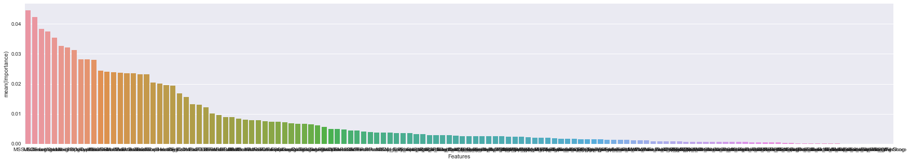


```python
submission['SalePrice'] = forest_reg.predict(x_test)
submission.to_csv('submission.csv', index=False)
```

The score on Kaggle is 0.86628, let's try feature selection

### Feature selection using SelectFromModel - Random forest


```python
print(x_std.shape)
model = SelectFromModel(forest_reg, prefit=True)
x_std_selected = model.transform(x_std)
x_test_std_selected = model.transform(x_test_std)
x_std_selected.shape, x_test_std_selected.shape
```

    (1460, 132)


    ((1460, 36), (1459, 36))


```python
features_select_from_model = x.columns[model.get_support()]
```

Select 36 out of 132 features


```python
forest_reg_selected = RandomForestRegressor(
    n_estimators=1000,
    criterion='mse',
    max_features=2,
    max_depth=None,
    min_samples_split=2,
    min_samples_leaf=1,
    bootstrap=True
)

forest_reg_selected = forest_reg_selected.fit(x_std_selected, y)

forest_selected_confidence = round(forest_reg_selected.score(x_std_selected, y) * 100, 2)
forest_selected_confidence
```


    98.239999999999995


```python
submission['SalePrice'] = forest_reg_selected.predict(x_test_std_selected)
submission.to_csv('submission.csv', index=False)
```

The submission scored 0.15558, which is an improvement of the previous score of 0.86628, great!

### Feature Selection using Forward selection algorithm	


```python
f = SelectKBest(f_regression, k=36)
x_std_f = f.fit_transform(x_std, y)
x_test_std_f = f.transform(x_test_std)
x_std_f.shape
```


    (1460, 36)


```python
forest_reg_f = RandomForestRegressor(
    n_estimators=1000,
    criterion='mse',
    max_features=2,
    max_depth=None,
    min_samples_split=2,
    min_samples_leaf=1,
    bootstrap=True
)

forest_reg_f = forest_reg_f.fit(x_std_f, y)

forest_f_confidence = round(forest_reg_f.score(x_std_f, y) * 100, 2)
forest_f_confidence
```


    98.200000000000003


```python
features_forward_selection = x.columns[f.get_support()]
print("Features selected from selectFromModel")
print(features_select_from_model)
importances = forest_reg_selected.feature_importances_
importance_rank = np.argsort(importances)[::-1]
fig, ax1 = plt.subplots(figsize=(30, 5))
sns.barplot(
    x='Features',
    y='Importance',
    data=pd.DataFrame(
        {
            'Features': list(x.columns[model.get_support()]),
            'Importance': [importances[r] for r in importance_rank]
        }
    ),
    ax=ax1
)
```

    Features selected from selectFromModel
    Index(['MSSubClass', 'MSZoning', 'LotFrontage', 'LotArea', 'Neighborhood',
           'OverallQual', 'OverallCond', 'YearBuilt', 'YearRemodAdd', 'MasVnrArea',
           'ExterQual', 'BsmtQual', 'BsmtExposure', 'TotalBsmtSF', 'HeatingQC',
           '1stFlrSF', '2ndFlrSF', 'GrLivArea', 'FullBath', 'BedroomAbvGr',
           'KitchenQual', 'TotRmsAbvGrd', 'Fireplaces', 'FireplaceQu',
           'GarageYrBlt', 'GarageFinish', 'GarageCars', 'GarageArea', 'WoodDeckSF',
           'OpenPorchSF', 'YrSold', 'MasVnrType_None', 'Foundation_CBlock',
           'Foundation_PConc', 'SaleType_New', 'BsmtFinScore'],
          dtype='object')


    <matplotlib.axes._subplots.AxesSubplot at 0x1338147f0>


```python
print("Features selected from forward selection algorithem")
print(features_forward_selection)
importances = forest_reg_f.feature_importances_
importance_rank = np.argsort(importances)[::-1]
fig, ax1 = plt.subplots(figsize=(30, 5))
sns.barplot(
    x='Features',
    y='Importance',
    data=pd.DataFrame(
        {
            'Features': list(x.columns[f.get_support()]),
            'Importance': [importances[r] for r in importance_rank]
        }
    ),
    ax=ax1
)
```

    Features selected from forward selection algorithem
    Index(['MSZoning', 'LotFrontage', 'Neighborhood', 'OverallQual', 'YearBuilt',
           'YearRemodAdd', 'MasVnrArea', 'ExterQual', 'BsmtQual', 'BsmtExposure',
           'TotalBsmtSF', 'HeatingQC', '1stFlrSF', '2ndFlrSF', 'GrLivArea',
           'FullBath', 'HalfBath', 'KitchenQual', 'TotRmsAbvGrd', 'Fireplaces',
           'FireplaceQu', 'GarageFinish', 'GarageCars', 'GarageArea', 'WoodDeckSF',
           'OpenPorchSF', 'MasVnrType_None', 'MasVnrType_Stone',
           'Foundation_CBlock', 'Foundation_PConc', 'GarageType_Attchd',
           'GarageType_Detchd', 'SaleType_New', 'SaleCondition_Partial',
           'Exterior_VinylSd', 'BsmtFinScore'],
          dtype='object')


    <matplotlib.axes._subplots.AxesSubplot at 0x133e2a7b8>


```python
intersection = np.intersect1d(features_select_from_model, features_forward_selection)
print("Features selected from both methods")
print(intersection)
print(intersection.shape)
```

    Features selected from both methods
    ['1stFlrSF' '2ndFlrSF' 'BsmtExposure' 'BsmtFinScore' 'BsmtQual' 'ExterQual'
     'FireplaceQu' 'Fireplaces' 'Foundation_CBlock' 'Foundation_PConc'
     'FullBath' 'GarageArea' 'GarageCars' 'GarageFinish' 'GrLivArea'
     'HeatingQC' 'KitchenQual' 'LotFrontage' 'MSZoning' 'MasVnrArea'
     'MasVnrType_None' 'Neighborhood' 'OpenPorchSF' 'OverallQual'
     'SaleType_New' 'TotRmsAbvGrd' 'TotalBsmtSF' 'WoodDeckSF' 'YearBuilt'
     'YearRemodAdd']
    (30,)


```python
submission['SalePrice'] = forest_reg_f.predict(x_test_std_f)
submission.to_csv('submission.csv', index=False)
```

The submission scored 0.15886

### Feature extraction with Principal component analysis (PCA)


```python
pca = PCA(
    n_components=0.3,
    svd_solver='full'
)

x_std_pca = pca.fit_transform(x_std)
x_test_std_pca = pca.transform(x_test_std)
x_std_pca.shape
```


    (1460, 8)


Extracted 8 out of 132 features


```python
forest_reg_pca = RandomForestRegressor(
    n_estimators=1000,
    criterion='mse',
    max_features=2,
    max_depth=None,
    min_samples_split=2,
    min_samples_leaf=1,
    bootstrap=True
)

forest_reg_pca = forest_reg_pca.fit(x_std_pca, y)

forest_pca_confidence = round(forest_reg_pca.score(x_std_pca, y) * 100, 2)
forest_pca_confidence
```


    97.510000000000005


```python
submission['SalePrice'] = forest_reg_pca.predict(x_test_std_pca)
submission.to_csv('submission.csv', index=False)
```

The submission scored 0.17882

## Summerize


```python
models = pd.DataFrame({
    'Model': ['Random Forest Regressor', 'Random Forest Regressor', 'Random Forest Regressor', 'Random Forest Regressor'],
    'Feature Engineering': ['None', 'Selection based on model', 'Forward selection algorithm', 'PCA'],
    'Confidence': [forest_confidence, forest_selected_confidence, forest_f_confidence, forest_pca_confidence],
    'Score': [0.86628, 0.15558, 0.15886, 0.17882]
})
models = models[['Model', 'Feature Engineering', 'Confidence', 'Score']]
models.sort_values(by='Score', ascending=True)
```


<div>
<table border="1" class="dataframe">
  <thead>
    <tr style="text-align: right;">
      <th></th>
      <th>Model</th>
      <th>Feature Engineering</th>
      <th>Confidence</th>
      <th>Score</th>
    </tr>
  </thead>
  <tbody>
    <tr>
      <th>1</th>
      <td>Random Forest Regressor</td>
      <td>Selection based on model</td>
      <td>98.24</td>
      <td>0.15558</td>
    </tr>
    <tr>
      <th>2</th>
      <td>Random Forest Regressor</td>
      <td>Forward selection algorithm</td>
      <td>98.20</td>
      <td>0.15886</td>
    </tr>
    <tr>
      <th>3</th>
      <td>Random Forest Regressor</td>
      <td>PCA</td>
      <td>97.51</td>
      <td>0.17882</td>
    </tr>
    <tr>
      <th>0</th>
      <td>Random Forest Regressor</td>
      <td>None</td>
      <td>97.65</td>
      <td>0.86628</td>
    </tr>
  </tbody>
</table>
</div>


```python

```
